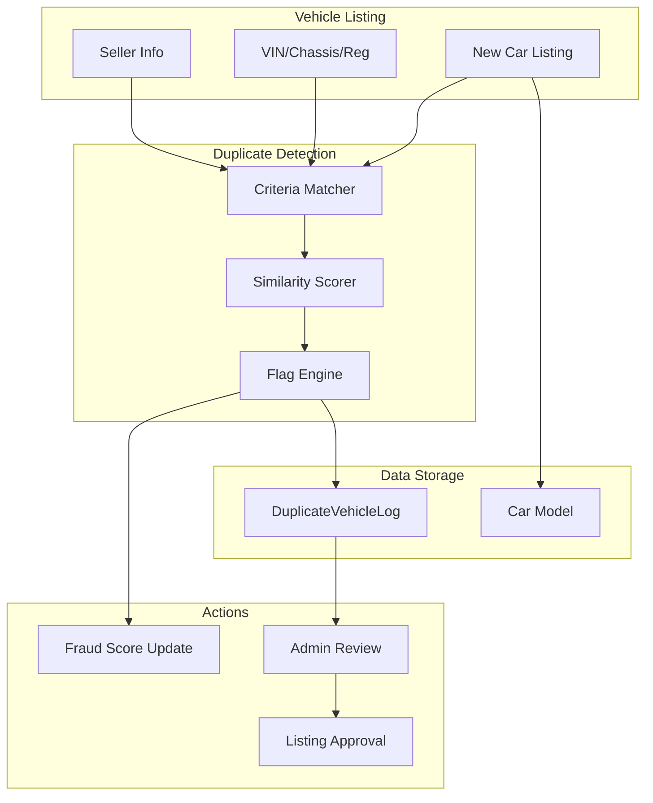

# Duplicate Vehicle Detection Engine - Architecture

**Phase:** Phase 3 - Fraud Prevention  
**Engineer:** Fraud Prevention Engineer  
**Date:** June 14, 2026  
**Scope:** Build production-grade duplicate vehicle detection system

---

## 📋 AUDIT FINDINGS

### Current Vehicle Listing Workflow

**Car Model (`backend/models/Car.js`):**
- Basic vehicle fields: title, brand, model, year, price, location, specs
- Dealer information: dealer (user reference), dealerPhone, isVerifiedDealer
- Fraud detection: fraudScore (0-100), trustScore (0-100)
- Kenya trust layer: ntsaVerified, dutyStatus, logbookVerified
- **MISSING:** VIN, chassis number, registration number fields
- No duplicate detection logic
- No duplicate tracking or logging

**Car Controller (`backend/controllers/carController.js`):**
- `createCar` function handles listing creation
- No duplicate checks before creation
- No fraud score updates based on duplicates
- No duplicate flagging or review workflow

**Current Gaps:**
1. No VIN/chassis/registration number fields for unique identification
2. No duplicate detection logic
3. No duplicate logging or tracking
4. No admin review workflow for flagged duplicates
5. No integration with existing fraud score system
6. No prevention of duplicate listings across different sellers

---

## 🎯 REQUIREMENTS

### Detection Criteria
- **VIN (Vehicle Identification Number)** - Unique 17-character identifier
- **Chassis Number** - Alternative unique identifier
- **Registration Number** - License plate number
- **Seller Phone** - Same phone number across multiple listings
- **Dealer Account** - Same dealer listing similar vehicles

### Behavior
- **DO NOT BLOCK** legitimate listings
- **FLAG** suspicious listings for admin review
- **UPDATE** fraud score based on duplicate detection
- **LOG** all duplicate detection events
- **PRESERVE** existing listing functionality

---

## 📐 ARCHITECTURE DESIGN

### System Architecture



### New Model: DuplicateVehicleLog

```javascript
{
  car: ObjectId (ref: Car),
  originalCar: ObjectId (ref: Car), // Original listing if duplicate
  dealer: ObjectId (ref: User),
  
  // Detection Criteria
  detectionCriteria: {
    vin: String,
    chassisNumber: String,
    registrationNumber: String,
    sellerPhone: String,
    dealerAccount: ObjectId (ref: User),
  },
  
  // Match Results
  matchType: enum ['exact_match', 'partial_match', 'potential_duplicate'],
  matchScore: Number (0-100),
  matchedCars: [ObjectId (ref: Car)],
  
  // Status
  status: enum ['flagged', 'under_review', 'confirmed_duplicate', 'false_positive', 'resolved'],
  
  // Admin Review
  reviewedBy: ObjectId (ref: User),
  reviewedAt: Date,
  reviewNotes: String,
  actionTaken: enum ['none', 'removed', 'merged', 'allowed'],
  
  // Fraud Impact
  fraudScoreImpact: Number,
  trustScoreImpact: Number,
  
  timestamps: true
}
```

### Service: duplicateVehicleService

**Functions:**
- `detectDuplicates(carData)` - Run duplicate detection on new listing
- `checkByVIN(vin)` - Find existing listings with same VIN
- `checkByChassis(chassisNumber)` - Find existing listings with same chassis
- `checkByRegistration(registrationNumber)` - Find existing listings with same registration
- `checkByPhone(phone)` - Find listings from same phone
- `checkByDealer(dealerId, similarityThreshold)` - Find similar listings from same dealer
- `calculateMatchScore(car1, car2)` - Calculate similarity score
- `flagDuplicate(carId, matchData)` - Flag listing as duplicate
- `logDetection(carId, detectionData)` - Log detection event
- `updateFraudScore(carId, impact)` - Update fraud/trust scores

### Car Model Updates

**New Fields:**
```javascript
{
  // Vehicle Identification
  vin: { type: String, index: true, sparse: true },
  chassisNumber: { type: String, index: true, sparse: true },
  registrationNumber: { type: String, index: true, sparse: true },
  
  // Duplicate Detection
  isFlaggedDuplicate: { type: Boolean, default: false, index: true },
  duplicateStatus: { type: String, enum: ['none', 'flagged', 'under_review', 'confirmed_duplicate', 'false_positive'], default: 'none' },
  duplicateLog: { type: mongoose.Schema.Types.ObjectId, ref: 'DuplicateVehicleLog' },
  
  // Duplicate References
  originalListing: { type: mongoose.Schema.Types.ObjectId, ref: 'Car' },
  duplicateListings: [{ type: mongoose.Schema.Types.ObjectId, ref: 'Car' }],
}
```

**New Indexes:**
- `vin` (sparse index for optional field)
- `chassisNumber` (sparse index)
- `registrationNumber` (sparse index)
- `isFlaggedDuplicate` (for filtering)
- `duplicateStatus` (for filtering)

---

## 🔄 WORKFLOW

### Listing Creation Flow

1. **Dealer submits listing** with VIN, chassis, registration (optional)
2. **duplicateVehicleService.detectDuplicates()** runs:
   - Check exact matches (VIN, chassis, registration)
   - Check partial matches (phone, dealer similarity)
   - Calculate match scores
3. **If duplicates found:**
   - Create DuplicateVehicleLog entry
   - Flag listing as `isFlaggedDuplicate = true`
   - Set `duplicateStatus = 'flagged'`
   - Update fraud score (increase risk)
   - Decrease trust score
   - Allow listing creation (non-blocking)
4. **If no duplicates:**
   - Create listing normally
   - No flags or score changes
5. **Admin reviews flagged listings:**
   - Confirm duplicate → remove/merge listings
   - False positive → clear flags, restore scores

### Admin Review Flow

1. **View flagged duplicates** via admin dashboard
2. **Review detection criteria** and matched listings
3. **Take action:**
   - `confirmed_duplicate` → Remove listing, mark as duplicate
   - `false_positive` → Clear flags, restore scores
   - `under_review` → Keep flagged for further investigation
4. **Update DuplicateVehicleLog** with review details
5. **Notify dealer** of action taken

---

## 📁 FILE STRUCTURE

### New Files
1. `backend/models/DuplicateVehicleLog.js` - Duplicate detection log model
2. `backend/services/duplicateVehicleService.js` - Duplicate detection service
3. `backend/controllers/duplicateController.js` - Admin duplicate management controller
4. `backend/routes/duplicateRoutes.js` - Admin duplicate management routes
5. `backend/tests/duplicateDetection.test.js` - Duplicate detection tests

### Modified Files
1. `backend/models/Car.js` - Add VIN, chassis, registration, duplicate fields
2. `backend/controllers/carController.js` - Integrate duplicate detection in createCar
3. `backend/validation/car.schema.js` - Add VIN/chassis/registration validation
4. `backend/server.js` - Register duplicate routes

---

## 🔒 SECURITY CONSIDERATIONS

1. **Data Privacy:** VIN and registration numbers are sensitive - limit access
2. **False Positives:** Allow admin override to prevent legitimate listings from being blocked
3. **Rate Limiting:** Prevent abuse of duplicate checking API
4. **Audit Trail:** Log all duplicate detection and review actions
5. **Fraud Score Integration:** Ensure score updates are reversible (false positive restoration)

---

## 📊 SUCCESS METRICS

1. **Duplicate Detection Rate:** % of listings flagged as duplicates
2. **False Positive Rate:** % of flagged listings confirmed as false positives (target: <5%)
3. **Time to Review:** Average time from flagging to admin review
4. **Fraud Score Impact:** Average fraud score increase for confirmed duplicates
5. **Legitimate Listing Impact:** % of legitimate listings affected (target: 0%)

---

## 🚀 DEPLOYMENT STRATEGY

### Phase 1: Schema Migration
1. Add new fields to Car model (non-breaking, optional fields)
2. Create DuplicateVehicleLog model
3. Add new indexes (background indexing for minimal impact)

### Phase 2: Service Integration
1. Deploy duplicateVehicleService
2. Integrate with createCar (non-blocking mode)
3. Monitor detection rate and false positives

### Phase 3: Admin Workflow
1. Deploy admin review endpoints
2. Train admins on review process
3. Enable full enforcement

### Phase 4: Optimization
1. Tune similarity thresholds based on real data
2. Add ML-based duplicate detection (future phase)
3. Integrate with external vehicle databases (future phase)

---

## ⚠️ RISKS & MITIGATIONS

### Risk: High False Positive Rate
**Mitigation:** 
- Conservative similarity thresholds initially
- Admin review workflow before enforcement
- Gradual threshold tuning based on data

### Risk: Legitimate Dealers Blocked
**Mitigation:** 
- Non-blocking approach (flag only, don't block)
- Quick admin review SLA (24 hours)
- Appeal process for false positives

### Risk: Performance Impact
**Mitigation:** 
- Sparse indexes for optional fields
- Async duplicate detection (background job)
- Caching of recent checks

### Risk: Data Privacy Violation
**Mitigation:** 
- Limit VIN/registration access to admins
- Encrypt sensitive fields at rest
- Audit access logs

---

## 📝 NEXT STEPS

1. ✅ Audit complete
2. ⏳ Create DuplicateVehicleLog model
3. ⏳ Update Car model with new fields
4. ⏳ Create duplicateVehicleService
5. ⏳ Integrate with createCar
6. ⏳ Create admin review workflow
7. ⏳ Create tests
8. ⏳ Deploy to staging
9. ⏳ Deploy to production
