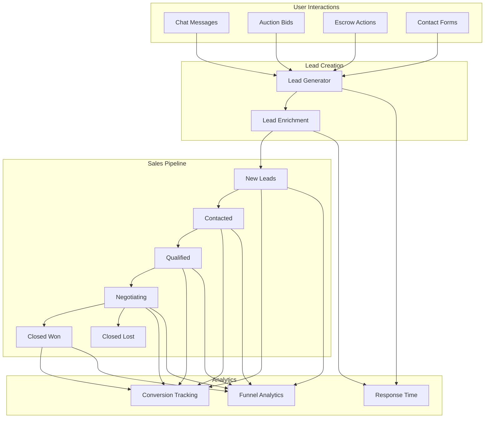

# Lead Intelligence System Architecture Plan

**Date:** June 15, 2026  
**Architect:** Marketplace CRM Architect  
**Project:** KAYAD Lead Intelligence System  
**Version:** 1.0.0

---

## Executive Summary

The Lead Intelligence system provides comprehensive CRM capabilities for dealers to track and manage buyer inquiries throughout the sales funnel. Every buyer interaction (chat, auction bid, escrow, contact form) automatically creates a lead that can be tracked through defined stages. The system provides analytics, conversion tracking, and response time metrics to help dealers improve their sales performance.

**Key Objectives:**
- Convert every buyer interaction into a trackable lead
- Provide clear visibility into sales pipeline stages
- Enable data-driven decision making with analytics
- Improve dealer response times and conversion rates
- Maintain backwards compatibility with existing systems

---

## Audit Findings

### Existing Chat System
**Model:** Chat.js
- Participants array (buyer + dealer)
- Car reference (optional)
- Messages array with sender, text, attachments, seenBy
- lastMessage tracking
- isBlocked flag
- Methods: addMessage, markAsSeen

**Model:** Message.js
- chatId reference
- sender, receiver
- text, attachments
- status (sent, delivered, seen)
- seenBy array
- isDeleted, isEdited flags
- Methods: markAsSeen, editMessage, softDelete

**Controller:** chatController.js
- startChat: Creates chat between participants
- getUserChats: Gets user's chat list
- sendMessage: Sends message with email/SMS notifications
- getMessages: Gets chat messages
- markAsSeen: Marks messages as seen
- deleteChat: Leaves/deletes chat

**Integration Points:**
- Chat creation triggers lead creation
- Message sending updates lead activity
- Response time tracking from message timestamps

### Existing Contact System
**Model:** Contact.js
- Simple contact form (name, email, subject, message)
- read flag
- No dealer association
- No vehicle association

**Integration Points:**
- Contact form submissions create leads
- Need to associate with dealer/vehicle

### Existing Auction System
**Model:** Auction.js
- carId reference
- roomId (unique)
- status (active, ended, pending_payment, completed, cancelled)
- startingBid, highestBid
- winner subdocument
- bidHistory array

**Controller:** bidController.js
- placeBid: Places auction bid
- Auto-bidding engine with loop prevention
- Payment integration
- Email/SMS notifications

**Integration Points:**
- Bid placement creates lead
- Auction completion updates lead stage
- Winner assignment updates lead status

### Existing Escrow System
**Model:** Escrow.js
- car, buyer, seller references
- amount, commission, sellerAmount
- status (pending, held, released, refunded, disputed)
- timeline stages
- history tracking

**Controller:** escrowController.js
- getAllEscrows: Admin view
- getUserEscrows: User's escrows
- getEscrowById: Single escrow details
- confirmDelivery: Buyer confirms delivery

**Integration Points:**
- Escrow creation updates lead stage to "Escrow Started"
- Escrow release updates lead stage to "Sold"
- Escrow refund updates lead stage to "Lost"

### Existing Vehicle System
**Model:** Car.js
- Basic info (title, brand, model, year, price)
- Location (city, address, coordinates)
- Specs (fuel, transmission, mileage, bodyType, color)
- Images array
- Dealer reference
- isDemo flag

**Integration Points:**
- Vehicle details included in lead
- Dealer association from vehicle

---

## Architecture Design

### System Architecture



### Architecture Design

### Lead Stages

| Stage | Description | Triggers |
|-------|-------------|----------|
| New | Initial lead creation | Chat start, bid placement, contact form |
| Contacted | Dealer responded to lead | First message from dealer |
| Negotiating | Active negotiation in progress | Multiple messages exchanged |
| Test Drive | Test drive scheduled/completed | Manual dealer action |
| Escrow Started | Escrow payment initiated | Escrow creation |
| Sold | Transaction completed | Escrow released |
| Lost | Lead not converted | Escrow refunded, manual marking |

### Lead Sources

| Source | Description |
|--------|-------------|
| chat | Chat initiated by buyer |
| auction | Bid placed on auction |
| contact_form | Contact form submission |
| direct_listing | Direct inquiry on listing |
| referral | Referred by another user |

### Data Model

#### Lead Model
```javascript
{
  // =============================
  // 🔗 RELATIONSHIPS
  // =============================
  buyer: { type: ObjectId, ref: "User", required: true, index: true },
  dealer: { type: ObjectId, ref: "User", required: true, index: true },
  vehicle: { type: ObjectId, ref: "Car", index: true },
  
  // =============================
  // 📋 LEAD INFO
  // =============================
  stage: {
    type: String,
    enum: ["new", "contacted", "negotiating", "test_drive", "escrow_started", "sold", "lost"],
    default: "new",
    index: true,
  },
  
  source: {
    type: String,
    enum: ["chat", "auction", "contact_form", "direct_listing", "referral"],
    required: true,
    index: true,
  },
  
  sourceReference: {
    type: ObjectId, // chatId, auctionId, contactId, etc.
  },
  
  // =============================
  // 📊 METRICS
  // =============================
  firstResponseTime: { type: Number }, // in minutes
  lastResponseTime: { type: Number }, // in minutes
  averageResponseTime: { type: Number }, // in minutes
  totalMessages: { type: Number, default: 0 },
  lastActivityAt: { type: Date, index: true },
  
  // =============================
  // 💰 VALUE
  // =============================
  estimatedValue: { type: Number }, // vehicle price or bid amount
  actualValue: { type: Number }, // final sale price
  
  // =============================
  // 📝 NOTES
  // =============================
  notes: { type: String, maxlength: 1000 },
  tags: [{ type: String }],
  
  // =============================
  // 🔒 STATUS
  // =============================
  isArchived: { type: Boolean, default: false, index: true },
  isHot: { type: Boolean, default: false, index: true }, // High priority lead
  
  // =============================
  // 📈 CONVERSION
  // =============================
  convertedAt: Date,
  lostAt: Date,
  lostReason: { type: String },
  
  timestamps: true,
}
```

#### LeadActivity Model
```javascript
{
  // =============================
  // 🔗 RELATIONSHIP
  // =============================
  lead: { type: ObjectId, ref: "Lead", required: true, index: true },
  
  // =============================
  // 📋 ACTIVITY TYPE
  // =============================
  type: {
    type: String,
    enum: [
      "lead_created",
      "stage_changed",
      "message_sent",
      "message_received",
      "bid_placed",
      "escrow_created",
      "escrow_released",
      "escrow_refunded",
      "note_added",
      "tag_added",
      "status_changed",
      "contacted",
    ],
    required: true,
    index: true,
  },
  
  // =============================
  // 👤 ACTOR
  // =============================
  actor: { type: ObjectId, ref: "User", required: true },
  actorType: { type: String, enum: ["buyer", "dealer", "system", "admin"] },
  
  // =============================
  // 📝 DETAILS
  // =============================
  description: { type: String },
  metadata: { type: Object, default: {} },
  
  // =============================
  // 🔗 REFERENCE
  // =============================
  referenceId: { type: ObjectId }, // messageId, escrowId, etc.
  referenceType: { type: String }, // message, escrow, etc.
  
  timestamps: true,
}
```

---

## File-by-File Implementation Plan

### 1. Database Models

#### 1.1 Create Lead Model
**File:** `backend/models/Lead.js`

**Schema:** As defined above

**Indexes:**
- buyer, dealer, vehicle (composite)
- stage
- source
- lastActivityAt
- isArchived
- isHot

**Methods:**
- `updateStage(newStage)` - Update lead stage
- `addActivity(type, actor, details)` - Add activity
- `calculateResponseTime()` - Calculate response time
- `archive()` - Archive lead
- `markAsHot()` - Mark as hot lead

#### 1.2 Create LeadActivity Model
**File:** `backend/models/LeadActivity.js`

**Schema:** As defined above

**Indexes:**
- lead, createdAt (for timeline)
- type
- actor

**Methods:**
- `createActivity(lead, type, actor, details)` - Create activity

### 2. Services

#### 2.1 Create Lead Service
**File:** `backend/services/leadService.js`

**Functions:**
- `createLead(buyerId, dealerId, vehicleId, source, referenceId)` - Create new lead
- `updateLeadStage(leadId, newStage, actorId)` - Update lead stage
- `addLeadActivity(leadId, type, actorId, details)` - Add activity
- `getDealerLeads(dealerId, filters)` - Get dealer's leads
- `getLeadById(leadId)` - Get lead details
- `archiveLead(leadId, actorId)` - Archive lead
- `markLeadAsHot(leadId, actorId)` - Mark as hot
- `calculateConversionRate(dealerId, startDate, endDate)` - Calculate conversion rate
- `calculateResponseTime(dealerId, startDate, endDate)` - Calculate average response time
- `getLeadPipeline(dealerId)` - Get lead pipeline counts
- `getLeadAnalytics(dealerId, startDate, endDate)` - Get lead analytics

#### 2.2 Create Lead Timeline Service
**File:** `backend/services/leadTimelineService.js`

**Functions:**
- `getLeadTimeline(leadId)` - Get lead activity timeline
- `addTimelineEvent(leadId, type, actor, details)` - Add timeline event
- `getLeadHistory(leadId)` - Get lead stage history

### 3. Controllers

#### 3.1 Create Lead Controller
**File:** `backend/controllers/leadController.js`

**Endpoints:**
- `GET /api/leads` - Get dealer's leads (with filters)
- `GET /api/leads/:leadId` - Get lead details
- `POST /api/leads` - Create lead manually
- `PUT /api/leads/:leadId/stage` - Update lead stage
- `PUT /api/leads/:leadId/archive` - Archive lead
- `PUT /api/leads/:leadId/hot` - Mark as hot
- `POST /api/leads/:leadId/notes` - Add note
- `GET /api/leads/:leadId/timeline` - Get lead timeline
- `GET /api/leads/analytics` - Get lead analytics
- `GET /api/leads/pipeline` - Get lead pipeline
- `GET /api/leads/conversion-report` - Get conversion report

### 4. Routes

#### 4.1 Create Lead Routes
**File:** `backend/routes/leadRoutes.js`

**Routes:**
- Protected routes for dealers
- Admin routes for oversight

### 5. Database Migrations

#### 5.1 Create Migration Script
**File:** `backend/migrations/migrate_lead_intelligence.js`

**Steps:**
1. Create Lead collection
2. Create LeadActivity collection
3. Add indexes
4. Backfill existing chats as leads
5. Backfill existing bids as leads
6. Backfill existing escrows as leads

### 6. Integration Points

#### 6.1 Chat System Integration
**File:** `backend/controllers/chatController.js`

**Changes:**
- On `startChat`: Create lead if not exists
- On `sendMessage`: Add lead activity
- Track response times

#### 6.2 Auction System Integration
**File:** `backend/controllers/bidController.js`

**Changes:**
- On `placeBid`: Create lead if not exists
- On auction completion: Update lead stage
- On winner assignment: Update lead status

#### 6.3 Escrow System Integration
**File:** `backend/controllers/escrowController.js`

**Changes:**
- On escrow creation: Update lead stage to "escrow_started"
- On escrow release: Update lead stage to "sold"
- On escrow refund: Update lead stage to "lost"

#### 6.4 Contact Form Integration
**File:** `backend/controllers/contactController.js`

**Changes:**
- On contact submission: Create lead
- Associate with dealer/vehicle if possible

### 7. Dashboard Components

#### 7.1 Dealer CRM Dashboard
**File:** `src/components/dealer/CRMDashboard.jsx`

**Components:**
- `LeadOverview` - Overview of lead counts and metrics
- `LeadPipeline` - Visual pipeline view
- `RecentLeads` - Recent leads list
- `ResponseTimeMetrics` - Response time analytics
- `ConversionMetrics` - Conversion rate tracking

#### 7.2 Lead Pipeline View
**File:** `src/components/dealer/LeadPipeline.jsx`

**Components:**
- Kanban-style pipeline view
- Drag and drop stage changes
- Lead cards with key info
- Stage counts and percentages

#### 7.3 Lead Analytics
**File:** `src/components/dealer/LeadAnalytics.jsx`

**Components:**
- Conversion rate chart
- Response time chart
- Lead source distribution
- Stage duration analysis
- Trend analysis over time

#### 7.4 Lead Conversion Reports
**File:** `src/components/dealer/LeadConversionReport.jsx`

**Components:**
- Conversion funnel
- Lost lead analysis
- Win/loss ratio
- Time to conversion
- Comparison with industry benchmarks

### 8. Tests

#### 8.1 Create Test Suite
**File:** `backend/tests/leadIntelligence.test.js`

**Tests:**
- Lead creation
- Lead stage updates
- Activity tracking
- Response time calculation
- Conversion rate calculation
- Pipeline analytics
- Integration with chat
- Integration with auction
- Integration with escrow
- Backwards compatibility

---

## Database Schema Changes

### New Collections
1. **Lead** - Store lead data
2. **LeadActivity** - Store lead activity timeline

### No Schema Changes to Existing Collections
- Chat model remains unchanged
- Message model remains unchanged
- Auction model remains unchanged
- Escrow model remains unchanged
- Car model remains unchanged
- Contact model remains unchanged

---

## API Endpoints

### Dealer Endpoints
```
GET /api/leads - Get dealer's leads
GET /api/leads/:leadId - Get lead details
POST /api/leads - Create lead manually
PUT /api/leads/:leadId/stage - Update lead stage
PUT /api/leads/:leadId/archive - Archive lead
PUT /api/leads/:leadId/hot - Mark as hot
POST /api/leads/:leadId/notes - Add note
GET /api/leads/:leadId/timeline - Get lead timeline
GET /api/leads/analytics - Get lead analytics
GET /api/leads/pipeline - Get lead pipeline
GET /api/leads/conversion-report - Get conversion report
```

### Admin Endpoints
```
GET /api/admin/leads - Get all leads
GET /api/admin/leads/analytics - Platform-wide analytics
GET /api/admin/leads/conversion-report - Platform conversion report
```

---

## Backwards Compatibility

### Preserved Functionality
- All existing chat workflows remain unchanged
- All existing auction workflows remain unchanged
- All existing escrow workflows remain unchanged
- No breaking changes to existing APIs

### New Functionality (Additive Only)
- New Lead model (separate collection)
- New LeadActivity model (separate collection)
- New lead service (separate module)
- New lead APIs (separate routes)
- New dashboard components (additive components)

### Migration Strategy
- Zero-downtime migration
- Backfill existing data as leads
- Gradual rollout
- Feature flags for enabling/disabling

---

## Performance Considerations

### Caching Strategy
- Cache lead lists in Redis with 5-minute TTL
- Cache pipeline data with 10-minute TTL
- Cache analytics with 15-minute TTL

### Batch Processing
- Process lead updates in batches
- Use MongoDB aggregation for analytics
- Parallel processing where possible

### Index Optimization
- Index on buyer, dealer, vehicle (composite)
- Index on stage for filtering
- Index on lastActivityAt for sorting
- Index on source for analytics

---

## Security Considerations

### Access Control
- Dealers can only access their own leads
- Admins can access all leads
- Buyers cannot access lead data
- Rate limiting on all endpoints

### Data Privacy
- No sensitive data in lead records
- Aggregate data for analytics
- No personal information exposure

### Audit Logging
- Log all lead stage changes
- Log all manual lead updates
- Log all lead deletions

---

## Monitoring and Alerting

### Metrics
- Lead creation rate
- Stage transition rates
- Response times
- Conversion rates
- Lead activity volume

### Alerts
- Alert on high lead volume
- Alert on low conversion rates
- Alert on slow response times
- Alert on system failures

---

## Success Metrics

### Platform Level
- Total leads created
- Overall conversion rate
- Average response time
- Lead source distribution

### Dealer Level
- Lead volume per dealer
- Conversion rate per dealer
- Response time per dealer
- Pipeline efficiency

### User Level
- Lead-to-sale time
- Customer satisfaction
- Repeat purchase rate

---

## Implementation Timeline

### Phase 1: Foundation (Week 1)
- Create Lead model
- Create LeadActivity model
- Create lead service
- Create lead timeline service
- Implement basic lead creation

### Phase 2: Integration (Week 2)
- Integrate with chat system
- Integrate with auction system
- Integrate with escrow system
- Integrate with contact form
- Test integrations

### Phase 3: APIs & Dashboard (Week 3)
- Create lead controller
- Create lead routes
- Create dealer CRM dashboard
- Create lead pipeline view
- Create lead analytics

### Phase 4: Testing & Launch (Week 4)
- Comprehensive testing
- Performance optimization
- Security audit
- Gradual rollout

---

## Risk Mitigation

### Technical Risks
- **Data Inconsistency:** Implement transactional updates
- **Performance Issues:** Implement caching and batch processing
- **Integration Failures:** Implement fallback mechanisms

### Business Risks
- **Dealer Adoption:** Clear communication and training
- **Data Overload:** Provide actionable insights only
- **Privacy Concerns:** Implement proper access controls

### Operational Risks
- **Migration Issues:** Test migration thoroughly
- **Downtime:** Zero-downtime migration strategy
- **Support Load:** Prepare support team

---

## Next Steps

1. Review and approve architecture plan
2. Create Lead model
3. Create LeadActivity model
4. Implement lead service
5. Implement lead timeline service
6. Integrate with chat system
7. Integrate with auction system
8. Integrate with escrow system
9. Create lead APIs
10. Create dashboard components
11. Test thoroughly
12. Deploy to production
13. Monitor and iterate

---

**Architecture Plan Completed:** June 15, 2026  
**Next Phase:** Implementation  
**Estimated Timeline:** 4 weeks
