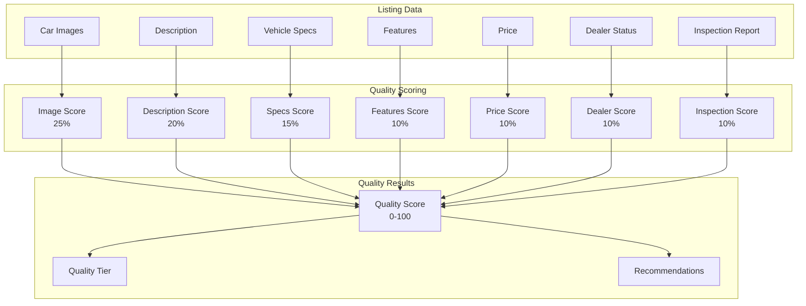

# Listing Quality Score Architecture Plan

**Date:** June 15, 2026  
**Architect:** Vehicle Marketplace Quality Engineer  
**Project:** KAYAD Listing Quality Score  
**Version:** 1.0.0

---

## Executive Summary

The Listing Quality Score system provides automated quality assessment for vehicle listings, enabling dealers to improve their listings and buyers to make informed decisions. The system calculates a quality score based on multiple factors and provides actionable recommendations for improvement without blocking listings.

**Key Objectives:**
- Automate quality assessment for vehicle listings
- Provide actionable improvement recommendations
- Enable data-driven quality decisions
- Improve marketplace listing quality
- Enhance buyer trust and confidence

---

## Audit Findings

### Car Model
**Model:** Car.js
- Contains listing attributes: title, brand, model, year, price, location, specs, images, description, features
- Images stored as array with url, thumb, public_id
- Cover image index
- Dealer reference
- No existing quality score or quality tracking

**Integration Points:**
- Can be extended with quality score field
- Can link to ListingQuality model
- Can trigger quality calculation on save/update

### InspectionOrder Model
**Model:** InspectionOrder.js
- Contains inspection reports with checklist, overall score, condition rating
- Links to Car model
- Has inspector notes and images
- Status tracking for inspection process

**Integration Points:**
- Inspection reports can contribute to quality score
- Overall score can be used as quality factor
- Condition rating can inform quality assessment

### DealerVerification Model
**Model:** DealerVerification.js
- Contains dealer verification status
- Document tracking for government ID, business license, etc.
- Verification states: pending, under_review, approved, rejected, suspended

**Integration Points:**
- Dealer verification status can impact listing quality
- Verified dealers get quality boost
- Document completeness affects quality score

---

## Architecture Design

### System Architecture



### Quality Score Factors

| Factor | Weight | Description | Data Source |
|--------|--------|-------------|-------------|
| Image Count | 25% | Number of images in listing | Car.images |
| Image Quality | 15% | Resolution, variety, clarity | Car.images |
| Description Quality | 20% | Length, detail, completeness | Car.description |
| Missing Attributes | 15% | Required vs provided attributes | Car model fields |
| Inspection Reports | 15% | Inspection score and completeness | InspectionOrder |
| Verification Status | 10% | Dealer verification status | DealerVerification |

### Quality Score Calculation

```javascript
Quality Score = (Image Count Score × 0.25) + 
                (Image Quality Score × 0.15) + 
                (Description Quality Score × 0.20) + 
                (Missing Attributes Score × 0.15) + 
                (Inspection Report Score × 0.15) + 
                (Verification Status Score × 0.10)
```

### Quality Ratings

| Score Range | Rating | Description |
|-------------|--------|-------------|
| 90-100 | Excellent | Outstanding listing quality |
| 70-89 | Good | Good listing quality with minor improvements |
| 50-69 | Average | Acceptable quality with notable improvements |
| 0-49 | Poor | Significant improvements needed |

### Data Model

#### ListingQuality Model
```javascript
{
  // =============================
  // 🔗 LINKED LISTING
  // =============================
  car: {
    type: mongoose.Schema.Types.ObjectId,
    ref: "Car",
    required: true,
    unique: true,
    index: true,
  },
  
  dealer: {
    type: mongoose.Schema.Types.ObjectId,
    ref: "User",
    index: true,
  },
  
  // =============================
  // 📊 QUALITY SCORE
  // =============================
  overallScore: {
    type: Number,
    min: 0,
    max: 100,
    index: true,
  },
  
  rating: {
    type: String,
    enum: ["Excellent", "Good", "Average", "Poor"],
    index: true,
  },
  
  // =============================
  // 📈 SCORE BREAKDOWN
  // =============================
  scoreBreakdown: {
    imageCount: {
      score: Number,
      weight: 0.25,
      details: {
        imageCount: Number,
        recommendedCount: Number,
      },
    },
    
    imageQuality: {
      score: Number,
      weight: 0.15,
      details: {
        resolution: String,
        variety: Number,
        clarity: Number,
      },
    },
    
    descriptionQuality: {
      score: Number,
      weight: 0.20,
      details: {
        wordCount: Number,
        recommendedMin: Number,
        completeness: Number,
      },
    },
    
    missingAttributes: {
      score: Number,
      weight: 0.15,
      details: {
        missingFields: [String],
        requiredFields: [String],
        providedFields: [String],
      },
    },
    
    inspectionReport: {
      score: Number,
      weight: 0.15,
      details: {
        hasInspection: Boolean,
        inspectionScore: Number,
        conditionRating: String,
      },
    },
    
    verificationStatus: {
      score: Number,
      weight: 0.10,
      details: {
        isVerified: Boolean,
        verificationStatus: String,
      },
    },
  },
  
  // =============================
  // 💡 RECOMMENDATIONS
  // =============================
  recommendations: [
    {
      category: String,
      priority: String,
      message: String,
      action: String,
    },
  ],
  
  // =============================
  // 📋 METADATA
  // =============================
  lastCalculatedAt: {
    type: Date,
    default: Date.now,
  },
  
  calculationVersion: {
    type: String,
    default: "1.0.0",
  },
  
  timestamps: true,
}
```

---

## File-by-File Implementation Plan

### 1. Database Models

#### 1.1 Create ListingQuality Model
**File:** `backend/models/ListingQuality.js`

**Schema:** As defined above

**Indexes:**
- car (unique)
- dealer
- overallScore
- rating

**Methods:**
- `calculateScore()` - Calculate overall quality score
- `calculateImageCountScore()` - Calculate image count score
- `calculateImageQualityScore()` - Calculate image quality score
- `calculateDescriptionQualityScore()` - Calculate description quality score
- `calculateMissingAttributesScore()` - Calculate missing attributes score
- `calculateInspectionReportScore()` - Calculate inspection report score
- `calculateVerificationStatusScore()` - Calculate verification status score
- `generateRecommendations()` - Generate improvement recommendations
- `getRating()` - Get quality rating based on score

### 2. Services

#### 2.1 Create ListingQuality Service
**File:** `backend/services/listingQualityService.js`

**Functions:**
- `calculateListingQuality(carId)` - Calculate quality score for a listing
- `recalculateListingQuality(carId)` - Recalculate quality score
- `getListingQuality(carId)` - Get quality score for a listing
- `getDealerQualityStats(dealerId)` - Get quality statistics for a dealer
- `getPlatformQualityStats()` - Get platform-wide quality statistics
- `getQualityTrends(period)` - Get quality trends over time
- `getLowQualityListings(threshold)` - Get listings below quality threshold
- `generateQualityReport(dealerId)` - Generate quality report for dealer
- `bulkRecalculateDealerQuality(dealerId)` - Recalculate all listings for dealer

### 3. Controllers

#### 3.1 Create ListingQuality Controller
**File:** `backend/controllers/listingQualityController.js`

**Endpoints:**
- `GET /api/listing-quality/:carId` - Get quality score for listing
- `POST /api/listing-quality/:carId/recalculate` - Recalculate quality score
- `GET /api/listing-quality/dealer/:dealerId/stats` - Get dealer quality stats
- `GET /api/listing-quality/dealer/:dealerId/report` - Get dealer quality report
- `GET /api/listing-quality/platform/stats` - Get platform quality stats
- `GET /api/listing-quality/trends` - Get quality trends
- `GET /api/listing-quality/low-quality` - Get low quality listings
- `POST /api/listing-quality/dealer/:dealerId/bulk-recalculate` - Bulk recalculate dealer listings

### 4. Routes

#### 4.1 Create ListingQuality Routes
**File:** `backend/routes/listingQualityRoutes.js`

**Routes:**
- Public routes for basic quality info
- Dealer routes for their quality stats
- Admin routes for platform-wide analytics

### 5. Database Migrations

#### 5.1 Create Migration Script
**File:** `backend/migrations/migrate_listing_quality.js`

**Steps:**
1. Create ListingQuality collection
2. Add indexes
3. Backfill quality scores for existing listings
4. Calculate initial quality scores

### 6. Dashboard Components

#### 6.1 Create Admin Quality Dashboard
**File:** `src/components/admin/ListingQualityDashboard.jsx`

**Components:**
- `PlatformQualityStats` - Platform-wide quality statistics
- `QualityTrends` - Quality trends over time
- `LowQualityListings` - Listings needing improvement
- `QualityDistribution` - Distribution of quality ratings
- `DealerQualityRankings` - Dealer quality rankings

#### 6.2 Create Dealer Quality Dashboard
**File:** `src/components/dealer/ListingQualityDashboard.jsx`

**Components:**
- `DealerQualityScore` - Overall dealer quality score
- `ListingQualityList` - Quality scores for all listings
- `ImprovementRecommendations` - Actionable recommendations
- `QualityTrends` - Quality trends over time
- `BenchmarkComparison` - Comparison with platform averages

---

## Migration Strategy

### Phase 1: Foundation (Week 1)
- Create ListingQuality model
- Create listing quality service
- Create quality calculation functions
- Test quality calculation logic

### Phase 2: Integration (Week 2)
- Integrate quality calculation into listing creation/update
- Add quality score to Car model (optional reference)
- Test integration with existing workflows
- Ensure no blocking of listings

### Phase 3: Dashboards (Week 3)
- Create admin quality dashboard
- Create dealer quality dashboard
- Implement quality APIs
- Test dashboard functionality

### Phase 4: Rollout (Week 4)
- Deploy quality calculation to production
- Backfill quality scores for existing listings
- Monitor quality score accuracy
- Train dealers on quality improvements

---

## Backwards Compatibility Strategy

### Default Behavior
- All existing listings remain unchanged
- Quality calculation is additive (non-blocking)
- No changes to listing creation workflow
- Quality score is informational only

### Migration Path
1. **Phase 1:** Deploy quality calculation without changing listing behavior
2. **Phase 2:** Add quality score to listing responses
3. **Phase 3:** Enable quality dashboards
4. **Phase 4:** Use quality scores for search ranking (optional)

### Rollback Plan
- If quality calculation fails, disable via environment variable
- Emergency disable of quality system
- Database rollback to remove quality scores
- Revert integration changes

---

## Quality Score Calculation Details

### Image Count Score (25%)
- 0 images: 0 points
- 1-3 images: 25 points
- 4-6 images: 50 points
- 7-9 images: 75 points
- 10+ images: 100 points

### Image Quality Score (15%)
- Resolution: High resolution (1000x1000+) = 100 points
- Variety: Multiple angles (exterior, interior, engine) = 100 points
- Clarity: Clear, well-lit images = 100 points

### Description Quality Score (20%)
- Word count: 0-50 words = 0 points, 51-100 = 50 points, 100+ = 100 points
- Completeness: Includes key details (condition, history, features) = 100 points
- Formatting: Well-structured with paragraphs = 100 points

### Missing Attributes Score (15%)
- Required fields: brand, model, year, price, mileage, fuel, transmission, bodyType, color, condition
- Score = (provided / required) × 100

### Inspection Report Score (15%)
- No inspection: 50 points (neutral)
- Inspection with score: Use inspection score
- Excellent condition: 100 points
- Good condition: 75 points
- Fair condition: 50 points
- Poor condition: 25 points

### Verification Status Score (10%)
- Not verified: 50 points (neutral)
- Pending verification: 50 points
- Verified: 100 points
- Rejected: 0 points

---

## Recommendation System

### Priority Levels
- **High**: Critical improvements that significantly impact quality
- **Medium**: Important improvements for better quality
- **Low**: Nice-to-have improvements

### Recommendation Categories
- **Images**: Add more images, improve image quality
- **Description**: Expand description, add more details
- **Attributes**: Fill in missing required fields
- **Inspection**: Get vehicle inspection
- **Verification**: Complete dealer verification

---

## Performance Considerations

### Caching Strategy
- Cache quality scores with 1-hour TTL
- Cache dealer quality stats with 30-minute TTL
- Cache platform stats with 15-minute TTL
- Use Redis for distributed caching

### Batch Processing
- Batch quality calculation for multiple listings
- Background job for bulk recalculation
- Queue-based processing for large dealers
- Parallel processing where possible

### Index Optimization
- Index on car field (unique)
- Index on dealer field
- Index on overallScore for filtering
- Index on rating for categorization

---

## Security Considerations

### Access Control
- Public access to basic quality scores
- Dealer access to their own quality stats
- Admin access to platform-wide analytics
- Rate limiting on quality calculation endpoints

### Data Privacy
- No personal information in quality scores
- Aggregate data for dashboards
- Anonymized quality reports
- Role-based access to detailed analytics

### Audit Logging
- Log quality score calculations
- Log quality score updates
- Log quality report generation
- Log bulk recalculation operations

---

## Testing Strategy

### Unit Tests
- Test quality score calculation logic
- Test individual factor calculations
- Test recommendation generation
- Test rating assignment

### Integration Tests
- Test quality calculation integration with Car model
- Test quality API endpoints
- Test cache invalidation
- Test bulk recalculation

### E2E Tests
- Test quality calculation in real scenarios
- Test dashboard functionality
- Test recommendation accuracy
- Test quality trends calculation

---

## Success Metrics

### Platform Level
- Quality calculation success rate > 99.9%
- Quality calculation latency < 2s
- Cache hit rate > 90%
- Zero impact on listing creation

### Business Level
- Average listing quality score improvement > 20%
- Dealer engagement with recommendations > 60%
- Buyer satisfaction with listing quality > 80%
- Search conversion improvement > 15%

---

## Next Steps

1. Review and approve architecture plan
2. Create ListingQuality model
3. Create listing quality service
4. Implement quality calculation logic
5. Integrate with listing creation/update
6. Create quality APIs
7. Create admin dashboard
8. Create dealer dashboard
9. Test thoroughly
10. Deploy to production
11. Monitor and iterate

---

**Architecture Plan Completed:** June 15, 2026  
**Next Phase:** Implementation  
**Estimated Timeline:** 4 weeks
