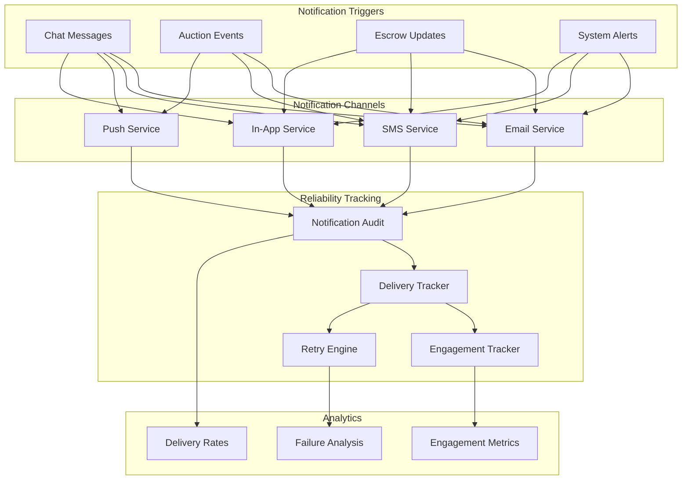

# Notification Reliability Tracking Architecture Plan

**Date:** June 15, 2026  
**Architect:** Messaging Infrastructure Architect  
**Project:** KAYAD Notification Reliability Tracking  
**Version:** 1.0.0

---

## Executive Summary

The Notification Reliability Tracking system provides comprehensive tracking and analytics for all notification channels (Email, SMS, Push, In-app). It enables monitoring of delivery rates, engagement metrics, and failure analysis with an automated retry engine for failed notifications. The system preserves existing notification behavior while adding deep visibility into notification performance.

**Key Objectives:**
- Track notification lifecycle across all channels
- Monitor delivery rates and engagement metrics
- Identify and analyze notification failures
- Provide automated retry for failed notifications
- Enable data-driven notification optimization
- Preserve existing notification behavior

---

## Audit Findings

### Notification Service
**File:** notificationService.js
- Handles sending notifications via multiple channels: push, email, SMS, WhatsApp
- Supports queue-based and synchronous processing
- User preference-based channel selection
- No tracking of delivery status or engagement
- No retry mechanism for failed notifications
- No analytics or reporting

**Integration Points:**
- Can be extended with audit tracking hooks
- Queue integration already exists
- Channel-specific send functions can be wrapped with tracking

### Notification Model
**File:** Notification.js
- Stores in-app notifications
- Tracks read status and read timestamp
- No delivery tracking
- No channel-specific tracking
- No engagement metrics (opened, clicked)
- No failure tracking

**Integration Points:**
- Can be extended with delivery tracking fields
- Can link to NotificationAudit for detailed tracking
- Can store audit reference for correlation

### Notification Queue
**File:** notificationQueue.js
- Queue-based notification processing
- Built-in retry with exponential backoff
- Supports bulk operations
- No tracking of retry outcomes
- No delivery confirmation tracking
- No failure analysis

**Integration Points:**
- Can add audit tracking on queue events
- Can track retry attempts and outcomes
- Can integrate with NotificationAudit model

### Channel Implementations
**Current State:**
- Push: Placeholder implementation (FCM/OneSignal integration needed)
- Email: Basic email sending (no delivery tracking)
- SMS: Basic SMS sending (no delivery tracking)
- WhatsApp: Basic WhatsApp sending (no delivery tracking)
- In-app: Full implementation with read tracking

**Gaps:**
- No delivery confirmations
- No open tracking
- No click tracking
- No bounce handling
- No spam detection

---

## Architecture Design

### System Architecture



### Architecture Design

### Notification Lifecycle

```
Queued → Sent → Delivered → Opened → Clicked
                ↓
              Failed → Retried → Delivered/Open/Clicked
```

### Tracked Events

| Event | Description | Data Source |
|-------|-------------|-------------|
| Queued | Notification added to queue | Queue system |
| Sent | Notification sent to provider | Channel provider |
| Delivered | Notification delivered to device | Provider webhook |
| Opened | User opened notification | Provider webhook/app |
| Clicked | User clicked notification | Provider webhook/app |
| Failed | Notification delivery failed | Provider webhook |
| Retried | Notification retry attempt | Queue system |

### Data Model

#### NotificationAudit Model
```javascript
{
  // =============================
  // 🔗 LINKED NOTIFICATION
  // =============================
  notificationId: {
    type: mongoose.Schema.Types.ObjectId,
    ref: "Notification",
    index: true,
  },
  
  userId: {
    type: mongoose.Schema.Types.ObjectId,
    ref: "User",
    index: true,
  },
  
  // =============================
  // 📢 NOTIFICATION DETAILS
  // =============================
  channel: {
    type: String,
    enum: ["email", "sms", "push", "whatsapp", "in_app"],
    required: true,
    index: true,
  },
  
  type: {
    type: String,
    enum: ["bid", "auction", "payment", "escrow", "chat", "system", "info", "referral", "price_alert"],
  },
  
  title: String,
  message: String,
  
  // =============================
  // 📊 DELIVERY TRACKING
  // =============================
  status: {
    type: String,
    enum: ["queued", "sent", "delivered", "opened", "clicked", "failed"],
    default: "queued",
    index: true,
  },
  
  queuedAt: {
    type: Date,
    default: Date.now,
  },
  
  sentAt: Date,
  deliveredAt: Date,
  openedAt: Date,
  clickedAt: Date,
  failedAt: Date,
  
  // =============================
  // 🔁 RETRY TRACKING
  // =============================
  retryCount: {
    type: Number,
    default: 0,
  },
  
  maxRetries: {
    type: Number,
    default: 3,
  },
  
  lastRetryAt: Date,
  nextRetryAt: Date,
  
  // =============================
  // ❌ FAILURE ANALYSIS
  // =============================
  failureReason: String,
  failureCode: String,
  providerResponse: mongoose.Schema.Types.Mixed,
  
  // =============================
  // 📈 ENGAGEMENT METRICS
  // =============================
  openRate: {
    type: Number,
    default: 0,
  },
  
  clickRate: {
    type: Number,
    default: 0,
  },
  
  // =============================
  // 🏷️ PROVIDER INFO
  // =============================
  provider: String,
  providerMessageId: String,
  providerTrackingId: String,
  
  // =============================
  // 📋 METADATA
  // =============================
  metadata: mongoose.Schema.Types.Mixed,
  
  timestamps: true,
}
```

---

## File-by-File Implementation Plan

### 1. Database Models

#### 1.1 Create NotificationAudit Model
**File:** `backend/models/NotificationAudit.js`

**Schema:** As defined above

**Indexes:**
- notificationId
- userId
- channel
- status
- queuedAt
- sentAt

**Methods:**
- `markSent()` - Mark notification as sent
- `markDelivered()` - Mark notification as delivered
- `markOpened()` - Mark notification as opened
- `markClicked()` - Mark notification as clicked
- `markFailed(reason, code)` - Mark notification as failed
- `incrementRetry()` - Increment retry count
- `scheduleRetry()` - Schedule next retry
- `calculateEngagement()` - Calculate engagement metrics

### 2. Services

#### 2.1 Create NotificationAnalytics Service
**File:** `backend/services/notificationAnalyticsService.js`

**Functions:**
- `trackNotification(notificationData)` - Track notification event
- `updateNotificationStatus(auditId, status, data)` - Update notification status
- `getDeliveryStats(period)` - Get delivery statistics
- `getChannelStats(period)` - Get channel statistics
- `getFailureAnalysis(period)` - Get failure analysis
- `getEngagementMetrics(period)` - Get engagement metrics
- `getRetryStats(period)` - Get retry statistics
- `getUserNotificationStats(userId, period)` - Get user notification stats
- `getPlatformNotificationStats(period)` - Get platform notification stats
- `generateDeliveryReport(period)` - Generate delivery report

#### 2.2 Create NotificationRetry Service
**File:** `backend/services/notificationRetryService.js`

**Functions:**
- `retryFailedNotification(auditId)` - Retry failed notification
- `bulkRetryFailedNotifications(channel, period)` - Bulk retry failed notifications
- `scheduleRetry(auditId)` - Schedule retry with exponential backoff
- `shouldRetry(audit)` - Check if notification should be retried
- `getRetryQueue()` - Get notifications pending retry
- `processRetryQueue()` - Process retry queue
- `calculateBackoff(retryCount)` - Calculate exponential backoff

### 3. Middleware

#### 3.1 Create Notification Tracking Middleware
**File:** `backend/middleware/notificationTracking.js`

**Functions:**
- `trackNotification()` - Wrap notification send with tracking
- `trackEmailSend()` - Track email sending
- `trackSMSSend()` - Track SMS sending
- `trackPushSend()` - Track push notification sending
- `trackWhatsAppSend()` - Track WhatsApp sending
- `handleWebhook()` - Handle provider webhooks for delivery/open/click

### 4. Controllers

#### 4.1 Create NotificationAnalytics Controller
**File:** `backend/controllers/notificationAnalyticsController.js`

**Endpoints:**
- `GET /api/notification-analytics/delivery-stats` - Get delivery statistics (admin)
- `GET /api/notification-analytics/channel-stats` - Get channel statistics (admin)
- `GET /api/notification-analytics/failure-analysis` - Get failure analysis (admin)
- `GET /api/notification-analytics/engagement-metrics` - Get engagement metrics (admin)
- `GET /api/notification-analytics/retry-stats` - Get retry statistics (admin)
- `GET /api/notification-analytics/user/:userId/stats` - Get user stats (admin)
- `POST /api/notification-analytics/retry/:auditId` - Retry notification (admin)
- `POST /api/notification-analytics/bulk-retry` - Bulk retry (admin)
- `GET /api/notification-analytics/report` - Generate delivery report (admin)

### 5. Routes

#### 5.1 Create NotificationAnalytics Routes
**File:** `backend/routes/notificationAnalyticsRoutes.js`

**Routes:**
- Admin routes for analytics and management
- Webhook routes for provider callbacks

### 6. Database Migrations

#### 6.1 Create Migration Script
**File:** `backend/migrations/migrate_notification_audit.js`

**Steps:**
1. Create NotificationAudit collection
2. Add indexes
3. Backfill audit records for recent notifications
4. Set up webhook endpoints

### 7. Dashboard Components

#### 7.1 Create Admin Delivery Dashboard
**File:** `src/components/admin/NotificationDeliveryDashboard.jsx`

**Components:**
- `DeliveryStats` - Overall delivery statistics
- `ChannelPerformance` - Channel-specific performance
- `DeliveryTrends` - Delivery trends over time
- `SuccessRate` - Success rate by channel
- `VolumeMetrics` - Notification volume metrics

#### 7.2 Create Failure Dashboard
**File:** `src/components/admin/NotificationFailureDashboard.jsx`

**Components:**
- `FailureAnalysis` - Failure breakdown by reason
- `ChannelFailures` - Failures by channel
- `RetryQueue` - Notifications pending retry
- `FailureTrends` - Failure trends over time
- `ProviderIssues` - Provider-specific issues

---

## Migration Strategy

### Phase 1: Foundation (Week 1)
- Create NotificationAudit model
- Create notification analytics service
- Create notification tracking middleware
- Test tracking functionality

### Phase 2: Integration (Week 2)
- Integrate tracking into existing notification service
- Add webhook endpoints for provider callbacks
- Implement retry engine
- Test integration with existing workflows

### Phase 3: Dashboards (Week 3)
- Create admin delivery dashboard
- Create failure dashboard
- Implement analytics APIs
- Test dashboard functionality

### Phase 4: Rollout (Week 4)
- Deploy tracking to production
- Enable webhooks for providers
- Monitor tracking accuracy
- Train users on dashboards

---

## Backwards Compatibility Strategy

### Default Behavior
- All existing notification flows remain unchanged
- Tracking is additive (non-blocking)
- No changes to notification API responses
- Retry engine is opt-in initially

### Migration Path
1. **Phase 1:** Deploy tracking without changing notification behavior
2. **Phase 2:** Enable tracking for new notifications
3. **Phase 3:** Enable retry engine for failed notifications
4. **Phase 4:** Use analytics for optimization

### Rollback Plan
- If tracking fails, disable via environment variable
- Emergency disable of tracking system
- Database rollback to remove audit records
- Revert middleware changes

---

## Retry Engine Design

### Retry Strategy
- **Exponential Backoff:** 1s, 2s, 4s, 8s, 16s, 32s
- **Max Retries:** 3 attempts (configurable)
- **Retry Conditions:** Transient failures, rate limits, provider errors
- **No Retry:** Permanent failures, invalid recipients, blocked users

### Retry Queue
- Priority-based retry queue
- Separate queues per channel
- Automatic retry scheduling
- Manual retry capability

### Failure Categories
- **Transient:** Network errors, rate limits, provider downtime
- **Permanent:** Invalid email/phone, blocked user, spam detection
- **Content:** Invalid template, missing required fields
- **Provider:** Provider-specific errors, API limits

---

## Performance Considerations

### Caching Strategy
- Cache delivery stats with 5-minute TTL
- Cache channel stats with 10-minute TTL
- Cache failure analysis with 15-minute TTL
- Use Redis for distributed caching

### Batch Processing
- Batch audit record writes
- Aggregate analytics in background jobs
- Use MongoDB aggregation for calculations
- Parallel processing where possible

### Index Optimization
- Index on notificationId, userId, channel
- Index on status for filtering
- Index on timestamps for time-based queries
- Compound indexes for common filter combinations

---

## Security Considerations

### Data Privacy
- Anonymize user data in analytics
- No personal information in audit logs
- Aggregate data for dashboards
- Role-based access to detailed analytics

### Webhook Security
- Verify webhook signatures
- Rate limit webhook endpoints
- Validate webhook payloads
- Log webhook events for audit

### Access Control
- Admin-only access to detailed analytics
- Rate limiting on analytics endpoints
- Audit log access to sensitive data
- Role-based access to retry functionality

---

## Testing Strategy

### Unit Tests
- Test notification audit model validation
- Test tracking middleware functions
- Test retry engine logic
- Test analytics calculation functions

### Integration Tests
- Test tracking integration with notification service
- Test webhook handling
- Test retry queue processing
- Test analytics API endpoints

### E2E Tests
- Test notification lifecycle tracking
- Test retry functionality
- Test dashboard functionality
- Test webhook integration with providers

---

## Success Metrics

### Platform Level
- Tracking success rate > 99.9%
- Analytics calculation latency < 3s
- Cache hit rate > 90%
- Zero impact on notification delivery

### Business Level
- Delivery rate improvement > 15%
- Retry success rate > 70%
- Failure identification accuracy > 80%
- Notification optimization impact > 20%

---

## Next Steps

1. Review and approve architecture plan
2. Create NotificationAudit model
3. Create notification analytics service
4. Create notification retry service
5. Create tracking middleware
6. Integrate with existing notification service
7. Create analytics APIs
8. Create admin delivery dashboard
9. Create failure dashboard
10. Test thoroughly
11. Deploy to production
12. Monitor and iterate

---

**Architecture Plan Completed:** June 15, 2026  
**Next Phase:** Implementation  
**Estimated Timeline:** 4 weeks
