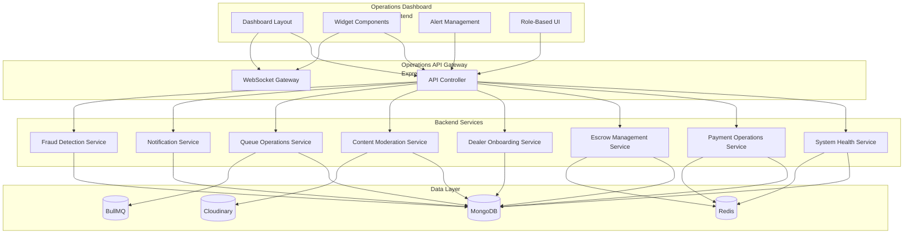

# Unified Operations Dashboard Architecture

**Version:** 1.0  
**Date:** June 17, 2026  
**Platform:** KAYAD Fintech Platform  
**Architect:** Marketplace Operations Architect

---

## Executive Summary

This document outlines the architecture for a unified operations dashboard that enables operations teams to manage the entire KAYAD platform from a single interface. The dashboard provides real-time visibility into system health, payment operations, escrow management, dealer onboarding, content moderation, queue operations, notifications, and fraud detection.

### Key Objectives

- **Unified Interface:** Single dashboard for all operations teams
- **Real-time Monitoring:** Live visibility into platform health and operations
- **Proactive Alerting:** Automated alerts for critical issues
- **Role-Based Access:** Granular permissions for different operations roles
- **Actionable Insights:** Data-driven decision making with drill-down capabilities

---

## 1. Dashboard Architecture

### 1.1 High-Level Architecture



### 1.2 Component Overview

**Frontend Components:**
- Dashboard Layout (React)
- Widget Components (8 operational widgets)
- Alert Management Interface
- Role-Based UI Rendering

**Backend Services:**
- Operations API Controller
- System Health Service
- Payment Operations Service
- Escrow Management Service
- Dealer Onboarding Service
- Content Moderation Service
- Queue Monitoring Service
- Notification Service
- Fraud Detection Service

**Data Layer:**
- MongoDB (transactional data)
- Redis (caching and real-time metrics)
- BullMQ (queue monitoring)
- Cloudinary (media management)

---

## 2. Dashboard Widgets

### 2.1 System Health Widget

**Purpose:** Monitor overall platform health and performance

**Metrics:**
- Server uptime and availability
- API response times (P50, P95, P99)
- Database connection status
- Redis connection status
- Queue worker status
- Error rates by endpoint
- Active user sessions

**Alerts:**
- Server downtime > 1 minute
- API response time > 2 seconds
- Database connection failure
- Redis connection failure
- Queue worker failure
- Error rate > 5%

**Actions:**
- View detailed metrics
- Restart services
- View error logs
- Configure alert thresholds

### 2.2 Payment Failures Widget

**Purpose:** Monitor and manage payment operations

**Metrics:**
- Total payment volume
- Payment success rate
- Payment failure rate
- Failed payment reasons (categorized)
- Pending payments
- Refund requests
- Payment processing time

**Alerts:**
- Payment failure rate > 10%
- Payment processing time > 30 seconds
- Refund request > 24 hours old
- Payment gateway errors

**Actions:**
- View failed payment details
- Retry failed payments
- Process refunds
- Investigate payment issues
- Export payment reports

### 2.3 Escrow Disputes Widget

**Purpose:** Manage escrow disputes and resolutions

**Metrics:**
- Active disputes
- Dispute resolution time
- Dispute success rate
- Dispute categories
- Pending resolutions
- Escrow balance

**Alerts:**
- New dispute created
- Dispute > 48 hours unresolved
- Escrow balance low
- Dispute resolution failure

**Actions:**
- View dispute details
- Approve/dispute resolution
- Release escrow funds
- Refund to buyer
- Add dispute notes

### 2.4 Dealer Onboarding Widget

**Purpose:** Manage dealer verification and onboarding

**Metrics:**
- Pending dealer applications
- Approved dealers (today/week/month)
- Rejected dealers (today/week/month)
- Average onboarding time
- Document verification status
- Dealer verification rate

**Alerts:**
- Pending application > 24 hours
- Verification failure rate > 20%
- Document upload failure
- Suspicious dealer activity

**Actions:**
- View application details
- Approve/reject applications
- Verify documents
- Request additional information
- Suspend dealer accounts

### 2.5 Listing Moderation Widget

**Purpose:** Moderate vehicle listings and content

**Metrics:**
- Pending listings
- Approved listings (today/week/month)
- Rejected listings (today/week/month)
- Flagged listings
- Moderation queue size
- Average moderation time

**Alerts:**
- Pending listing > 12 hours
- Flagged listing > 6 hours
- Duplicate listing detected
- Suspicious listing activity

**Actions:**
- View listing details
- Approve/reject listings
- Edit listing content
- Remove inappropriate content
- Flag for review

### 2.6 Queue Health Widget

**Purpose:** Monitor background job queues

**Metrics:**
- Queue sizes (email, notification, SMS, fraud, image, SEO)
- Job processing rates
- Failed jobs count
- Dead letter queue size
- Worker status
- Average job processing time

**Alerts:**
- Queue size > 1000
- Failed jobs > 100
- Worker offline
- Job processing time > 5 minutes
- Dead letter queue > 50

**Actions:**
- View queue details
- Retry failed jobs
- Purge queues
- Scale workers
- View job logs

### 2.7 Notifications Widget

**Purpose:** Monitor and manage notification delivery

**Metrics:**
- Notification volume (email, SMS, push, in-app)
- Delivery success rate
- Failed notifications
- Notification processing time
- User notification preferences

**Alerts:**
- Delivery failure rate > 10%
- Failed notifications > 100
- Notification queue backlog
- Critical notification failure

**Actions:**
- View notification details
- Retry failed notifications
- Configure notification channels
- View delivery logs
- Manage user preferences

### 2.8 Fraud Alerts Widget

**Purpose:** Monitor and manage fraud detection

**Metrics:**
- Fraud alerts (today/week/month)
- Confirmed fraud cases
- False positive rate
- Fraud detection rate
- High-risk users
- Blocked transactions

**Alerts:**
- New fraud alert
- High-risk user activity
- Suspicious transaction pattern
- Fraud detection failure

**Actions:**
- View alert details
- Confirm/reject fraud alerts
- Block user accounts
- Freeze transactions
- Add to watchlist

---

## 3. Role-Based Access Control (RBAC)

### 3.1 Operations Roles

**Superadmin**
- Full access to all dashboard features
- Can manage other operations users
- Can configure system settings
- Can view all data and perform all actions

**Operations Manager**
- Full access to all dashboard features
- Can manage operations team
- Can configure operational settings
- Cannot manage system-level settings

**Support Agent**
- View-only access to most widgets
- Limited action permissions (e.g., can approve simple requests)
- Cannot access sensitive financial data
- Cannot modify system settings

**Moderator**
- Full access to listing moderation
- Limited access to other widgets
- Can approve/reject listings
- Cannot access financial data

**Analyst**
- View-only access to all widgets
- Can export reports
- Cannot perform actions
- Cannot access sensitive data

### 3.2 Permission Matrix

| Widget/Action | Superadmin | Operations Manager | Support Agent | Moderator | Analyst |
|--------------|------------|-------------------|---------------|-----------|---------|
| **System Health** | | | | | |
| View metrics | ✅ | ✅ | ✅ | ✅ | ✅ |
| Restart services | ✅ | ✅ | ❌ | ❌ | ❌ |
| View error logs | ✅ | ✅ | ✅ | ❌ | ✅ |
| **Payment Failures** | | | | | |
| View metrics | ✅ | ✅ | ✅ | ❌ | ✅ |
| Retry payments | ✅ | ✅ | ❌ | ❌ | ❌ |
| Process refunds | ✅ | ✅ | ❌ | ❌ | ❌ |
| Export reports | ✅ | ✅ | ✅ | ❌ | ✅ |
| **Escrow Disputes** | | | | | |
| View metrics | ✅ | ✅ | ✅ | ❌ | ✅ |
| Resolve disputes | ✅ | ✅ | ❌ | ❌ | ❌ |
| Release funds | ✅ | ✅ | ❌ | ❌ | ❌ |
| **Dealer Onboarding** | | | | | |
| View metrics | ✅ | ✅ | ✅ | ❌ | ✅ |
| Approve/reject | ✅ | ✅ | ❌ | ❌ | ❌ |
| Verify documents | ✅ | ✅ | ❌ | ❌ | ❌ |
| Suspend accounts | ✅ | ✅ | ❌ | ❌ | ❌ |
| **Listing Moderation** | | | | | |
| View metrics | ✅ | ✅ | ✅ | ✅ | ✅ |
| Approve/reject | ✅ | ✅ | ❌ | ✅ | ❌ |
| Edit content | ✅ | ✅ | ❌ | ✅ | ❌ |
| **Queue Health** | | | | | |
| View metrics | ✅ | ✅ | ✅ | ❌ | ✅ |
| Retry jobs | ✅ | ✅ | ❌ | ❌ | ❌ |
| Scale workers | ✅ | ✅ | ❌ | ❌ | ❌ |
| **Notifications** | | | | | |
| View metrics | ✅ | ✅ | ✅ | ❌ | ✅ |
| Retry notifications | ✅ | ✅ | ❌ | ❌ | ❌ |
| Configure channels | ✅ | ✅ | ❌ | ❌ | ❌ |
| **Fraud Alerts** | | | | | |
| View metrics | ✅ | ✅ | ✅ | ❌ | ✅ |
| Confirm/reject alerts | ✅ | ✅ | ❌ | ❌ | ❌ |
| Block accounts | ✅ | ✅ | ❌ | ❌ | ❌ |
| Freeze transactions | ✅ | ✅ | ❌ | ❌ | ❌ |

---

## 4. Alert Workflows

### 4.1 Alert Severity Levels

**Critical (P0)**
- Immediate action required
- Platform-wide impact
- Revenue loss > $10,000/hour
- User data at risk

**High (P1)**
- Action required within 1 hour
- Significant user impact
- Revenue loss > $1,000/hour

**Medium (P2)**
- Action required within 4 hours
- Moderate user impact
- Revenue loss > $100/hour

**Low (P3)**
- Action required within 24 hours
- Minor user impact
- No revenue loss

### 4.2 Alert Escalation Workflow

```
┌─────────────┐
│   Alert     │
│  Generated  │
└──────┬──────┘
       │
       ▼
┌─────────────┐
│ Auto-Assign │
│  to Role    │
└──────┬──────┘
       │
       ▼
┌─────────────┐
│  Notify     │
│  Assigned   │
└──────┬──────┘
       │
       ▼
┌─────────────┐
│  SLA Timer  │
│  Started    │
└──────┬──────┘
       │
       ▼
┌─────────────┐
│  Resolved?  │
└──────┬──────┘
       │
   ┌───┴───┐
   │       │
  Yes      No
   │       │
   ▼       ▼
┌──────┐ ┌──────────┐
│ Close │ │ Escalate │
└──────┘ └────┬─────┘
             │
             ▼
      ┌──────────┐
      │ Notify   │
      │ Manager  │
      └────┬─────┘
           │
           ▼
      ┌──────────┐
      │ Escalate │
      │ to Super │
      └──────────┘
```

### 4.3 Alert SLAs

| Severity | Response Time | Resolution Time | Escalation Time |
|----------|---------------|-----------------|-----------------|
| P0 Critical | 5 minutes | 30 minutes | 15 minutes |
| P1 High | 15 minutes | 2 hours | 1 hour |
| P2 Medium | 1 hour | 8 hours | 4 hours |
| P3 Low | 4 hours | 24 hours | 12 hours |

### 4.4 Alert Notification Channels

**P0 Critical:**
- SMS to on-call engineer
- Phone call to on-call engineer
- Email to operations team
- Push notification to mobile app
- Slack #ops-critical channel

**P1 High:**
- SMS to on-call engineer
- Email to operations team
- Push notification to mobile app
- Slack #ops-high channel

**P2 Medium:**
- Email to operations team
- Push notification to mobile app
- Slack #ops-medium channel

**P3 Low:**
- Email to operations team
- Slack #ops-low channel

---

## 5. Technical Implementation

### 5.1 Frontend Technology Stack

- **Framework:** React 18
- **UI Library:** TailwindCSS + shadcn/ui
- **State Management:** React Query + Zustand
- **Real-time Updates:** WebSocket
- **Charts:** Recharts
- **Icons:** Lucide React

### 5.2 Backend Technology Stack

- **Framework:** Express.js
- **API:** REST + WebSocket
- **Authentication:** JWT + Role-Based Access
- **Rate Limiting:** Express Rate Limit
- **Validation:** Joi

### 5.3 Data Flow

```
User Request → API Gateway → RBAC Check → Service Layer → Data Layer → Response
                      ↓
                 WebSocket → Real-time Updates → Frontend
```

### 5.4 Caching Strategy

- **Dashboard Data:** Redis (5-minute TTL)
- **Widget Data:** Redis (1-minute TTL for real-time widgets)
- **User Permissions:** Redis (30-minute TTL)
- **Alert Data:** MongoDB (persistent)

### 5.5 Real-time Updates

- **WebSocket Connection:** Persistent connection for dashboard
- **Update Frequency:** 30 seconds for metrics, instant for alerts
- **Reconnection Strategy:** Automatic with exponential backoff
- **Fallback:** Polling every 30 seconds if WebSocket fails

---

## 6. Security Considerations

### 6.1 Authentication

- JWT-based authentication
- Multi-factor authentication for critical actions
- Session timeout after 30 minutes of inactivity
- IP whitelisting for operations dashboard access

### 6.2 Authorization

- Role-based access control (RBAC)
- Permission checks on every API endpoint
- Audit logging for all actions
- Least privilege principle

### 6.3 Data Protection

- Sensitive data encryption at rest
- TLS 1.3 for all communications
- PII redaction in logs
- Regular security audits

### 6.4 Audit Logging

- All user actions logged
- Include timestamp, user, action, and result
- Immutable log storage
- Regular log analysis for security incidents

---

## 7. Performance Requirements

### 7.1 Dashboard Performance

- **Initial Load:** < 2 seconds
- **Widget Load:** < 500ms per widget
- **Data Refresh:** < 1 second
- **Alert Delivery:** < 5 seconds

### 7.2 API Performance

- **Response Time:** P50 < 100ms, P95 < 300ms, P99 < 500ms
- **Throughput:** 1000+ requests/second
- **Availability:** 99.9% uptime
- **Error Rate:** < 0.1%

### 7.3 Scalability

- **Concurrent Users:** 100+ operations users
- **Data Volume:** Support 1M+ records per widget
- **Horizontal Scaling:** Stateless API servers
- **Database Sharding:** If data volume exceeds single node capacity

---

## 8. Implementation Phases

### Phase 1: Core Dashboard (Week 1-2)
- Dashboard layout and navigation
- System health widget
- Backend API endpoints
- RBAC implementation

### Phase 2: Operational Widgets (Week 3-4)
- Payment failures widget
- Escrow disputes widget
- Dealer onboarding widget
- Listing moderation widget

### Phase 3: Queue & Notifications (Week 5-6)
- Queue health widget
- Notifications widget
- Fraud alerts widget
- Real-time updates via WebSocket

### Phase 4: Alert Workflows (Week 7-8)
- Alert generation logic
- Alert notification system
- Escalation workflows
- SLA monitoring

### Phase 5: Testing & Deployment (Week 9-10)
- Integration testing
- Load testing
- Security testing
- Production deployment

---

## 9. Success Metrics

### 9.1 Operational Metrics

- **Mean Time to Detect (MTTD):** < 5 minutes for critical issues
- **Mean Time to Resolve (MTTR):** < 30 minutes for critical issues
- **Alert Accuracy:** > 95% (low false positive rate)
- **Dashboard Adoption:** 100% of operations team using dashboard

### 9.2 Business Metrics

- **Payment Failure Rate:** < 5%
- **Escrow Dispute Resolution Time:** < 48 hours
- **Dealer Onboarding Time:** < 24 hours
- **Listing Moderation Time:** < 12 hours

### 9.3 User Experience Metrics

- **Dashboard Load Time:** < 2 seconds
- **Widget Load Time:** < 500ms
- **User Satisfaction:** > 4.5/5
- **Task Completion Rate:** > 90%

---

## 10. Conclusion

The unified operations dashboard provides a comprehensive solution for managing the KAYAD platform from a single interface. The architecture ensures real-time visibility, proactive alerting, and efficient workflows for operations teams. The role-based access control ensures appropriate permissions while maintaining security. The phased implementation approach minimizes risk while delivering value incrementally.

---

**Document Version:** 1.0  
**Last Updated:** June 17, 2026  
**Next Review:** July 17, 2026
