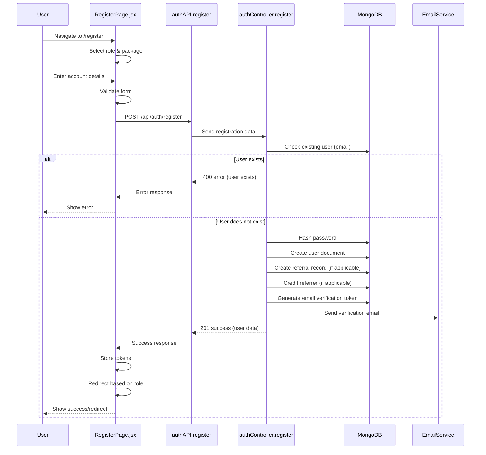
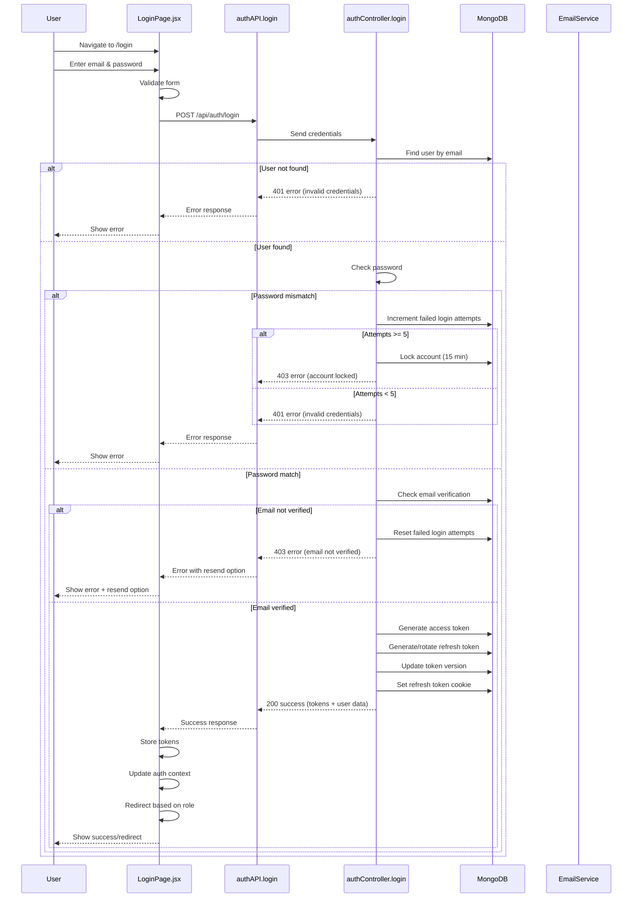
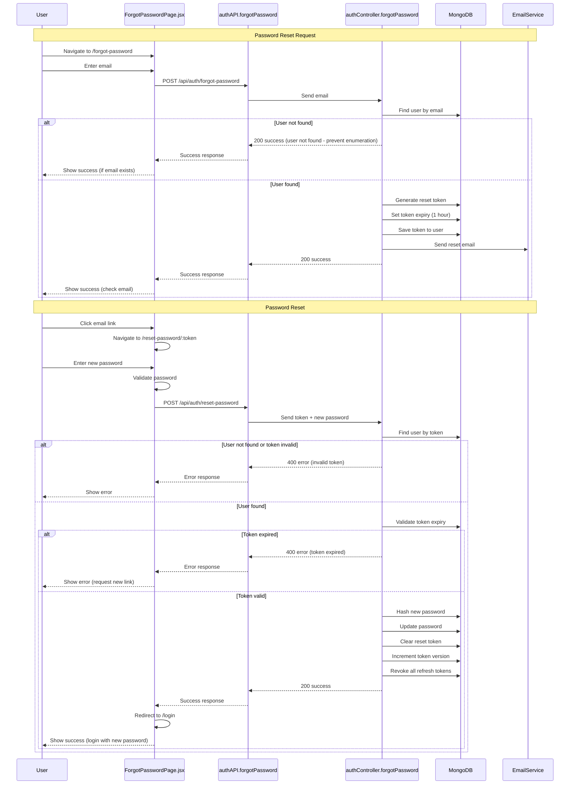
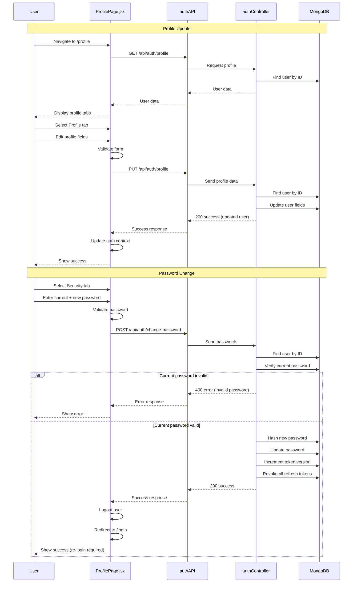
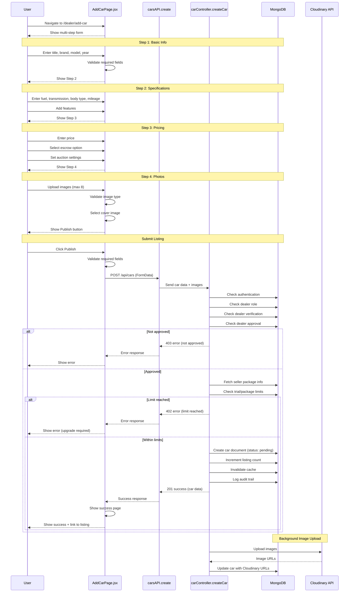
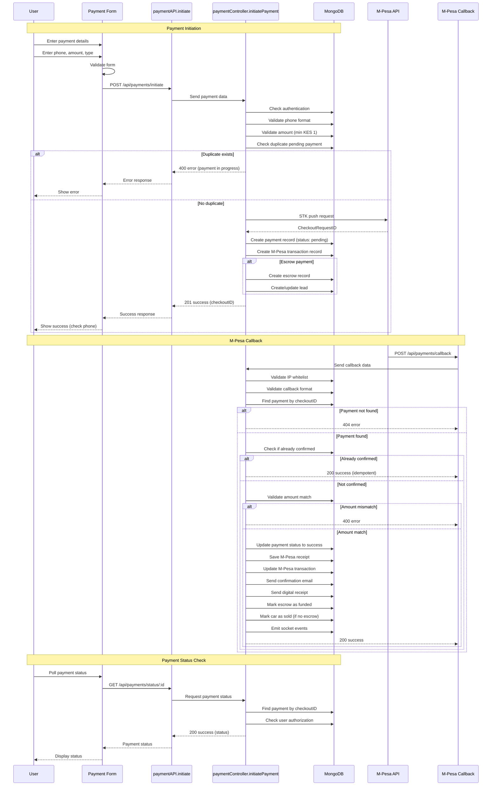
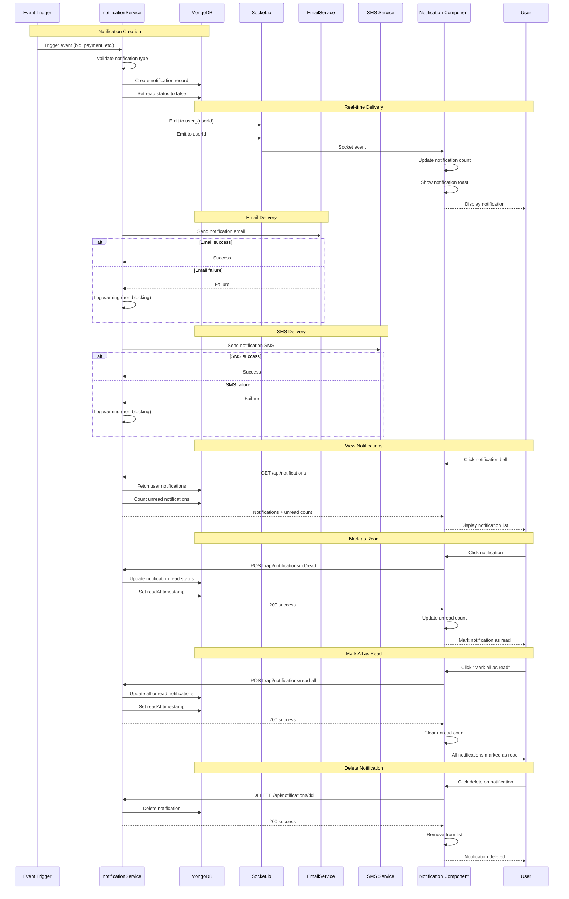
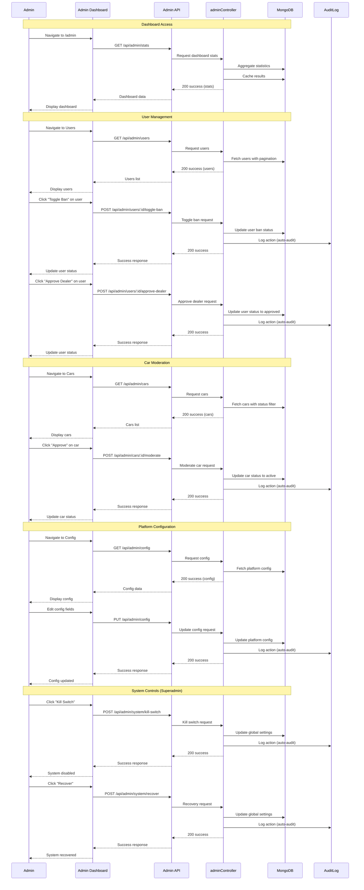
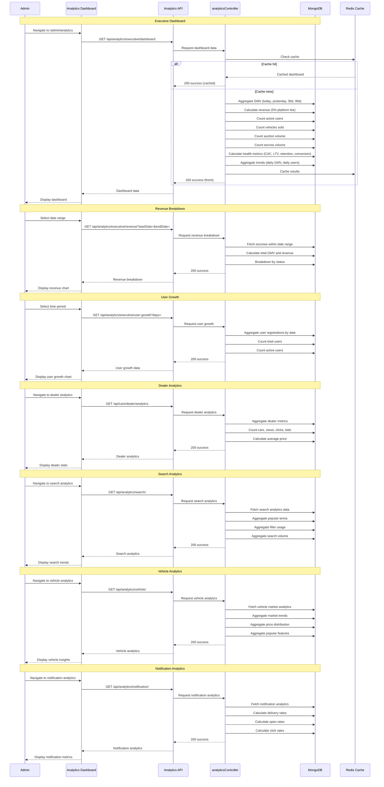

# User Journey Mapping - KAYAD Platform

This document maps all critical user journeys from frontend to backend, identifying components, APIs, database operations, failure points, and missing validation.

## 1. Registration Flow

### Frontend Components
- **RegisterPage.jsx** (`src/pages/RegisterPage.jsx`)
  - RoleSelectorStep
  - PackageSelectorStep
  - AccountFormStep
  - WaitingRoom

### Backend APIs
- **POST /api/auth/register** (`backend/routes/authRoutes.js`)
  - Route: `router.post("/register", authLimiter, validateAuth, asyncHandler(register))`
  - Controller: `register` (`backend/controllers/authController.js`)

### Database Operations
- **User.create()** - Creates new user document
- **User.findOne()** - Checks if email already exists
- **User.findByIdAndUpdate()** - Credits referrer (if applicable)
- **Referral.create()** - Creates referral record
- **PlatformConfig.findOne()** - Fetches platform configuration for dealer approval settings

### Flow Sequence

```
1. User selects role (user, dealer, broker, individual_seller)
2. If dealer/broker/individual_seller, selects package
3. Fills account form (name, email, password, phone, businessName, location)
4. Frontend validation: password >= 8 characters
5. POST /api/auth/register with body:
   {
     name, email, password, role, phone, businessName, location,
     referralCode?, dealerPackage?
   }
6. Backend validation:
   - Required fields: name, email, password
   - Password length >= 8
   - Email uniqueness check
   - Phone format validation (Kenyan format)
   - Role validation (only dealer, broker, individual_seller allowed for self-registration)
7. Database operations:
   - Create user with hashed password
   - Set email verification token (24h expiry)
   - Credit referrer if referral code valid
   - Create referral record
8. Send verification email (non-blocking)
9. Send welcome email (non-blocking)
10. Notify admins of pending seller approval (if needs approval)
11. Return auth response with access token and refresh token
12. Redirect based on role and approval status:
    - Buyer: verification prompt or dashboard
    - Dealer/Broker/Individual Seller: waiting room (if pending) or dealer hub (if approved)
```

### Failure Points
1. **Email already exists** - Returns 400 error
2. **Password too short** - Frontend validation (8 chars), backend validation (8 chars)
3. **Invalid phone format** - formatPhone() may return null
4. **Email service unavailable** - Non-blocking, registration succeeds
5. **Referral code invalid** - Non-blocking, registration succeeds
6. **Platform config missing** - Falls back to auto-approve
7. **Database connection failure** - Returns 500 error
8. **Rate limiting** - authLimiter middleware may block requests

### Missing Validation
1. **Email format validation** - No regex validation for email format
2. **Name validation** - No minimum length check (schema has minlength: 2)
3. **Business name validation** - No validation for business name when required
4. **Location validation** - No validation for location when required
5. **Package validation** - No check if package exists before assignment
6. **Referral code format** - No validation of referral code format
7. **Password strength** - Only length check, no complexity requirements
8. **Phone uniqueness** - No check if phone number already registered

### Security Concerns
1. **Password hashing** - Uses bcryptjs (good)
2. **Token generation** - JWT with proper expiry
3. **Rate limiting** - authLimiter applied
4. **Email verification** - Token-based verification with 24h expiry
5. **Referral self-refer guard** - Prevents self-referral

### Remediation Recommendations
1. Add email format validation (regex)
2. Add password complexity requirements (uppercase, lowercase, number, special char)
3. Add phone uniqueness check
4. Add business name validation (required for sellers)
5. Add location validation (required for sellers)
6. Add package existence validation
7. Add referral code format validation
8. Add CAPTCHA for registration to prevent bot spam
9. Add IP-based rate limiting in addition to authLimiter
10. Add email verification requirement before full access

---

## 2. Login Flow

### Frontend Components
- **LoginPage.jsx** (`src/pages/LoginPage.jsx`)
  - Email input
  - Password input with show/hide toggle
  - Demo account buttons (Buyer, Dealer, Broker)
  - Resend verification email button
  - Forgot password link

### Backend APIs
- **POST /api/auth/login** (`backend/routes/authRoutes.js`)
  - Route: `router.post("/login", authLimiter, validateAuth, asyncHandler(login))`
  - Controller: `login` (`backend/controllers/authController.js`)
- **POST /api/auth/refresh** (`backend/routes/authRoutes.js`)
  - Route: `router.post("/refresh", authLimiter, asyncHandler(refreshToken))`
  - Controller: `refreshToken` (`backend/controllers/authController.js`)

### Database Operations
- **User.findOne()** - Fetch user by email with password and tokenVersion
- **User.save()** - Update login attempts, lock status, last login time
- **RefreshToken.create()** - Create new refresh token
- **RefreshToken.revokeToken()** - Revoke old refresh token (rotation)

### Flow Sequence

```
1. User enters email and password
2. Frontend validation: email and password required
3. POST /api/auth/login with body: { email, password }
4. Backend validation:
   - Email and password required
   - Email lowercase and trim
5. Database operations:
   - Find user by email with password field
6. Security checks:
   - Check if account is locked (lockUntil > now)
   - Check if account is banned (isBanned)
   - Check if account is deactivated (deactivatedAt)
   - Check email verification (if required)
7. Password verification:
   - Compare password hash using bcrypt
8. Account lockout mechanism:
   - Track failed login attempts (loginAttempts)
   - Lock account for 15 minutes after 5 failed attempts
   - Reset attempts on successful login
9. Email verification gate:
   - Only enforce if EMAIL_HOST is configured
   - Override with REQUIRE_EMAIL_VERIFICATION env var
   - Demo accounts bypass verification
10. Generate tokens:
    - Generate access token (1h expiry)
    - Generate refresh token (30 days expiry)
    - Store refresh token in database with rotation
11. Set cookies:
    - Set refreshToken cookie (httpOnly, secure, sameSite: lax)
    - Set accessToken cookie (httpOnly, secure, sameSite: lax)
12. Return auth response with user data
13. Redirect based on role and approval status:
    - Buyer: dashboard
    - Dealer/Broker: dealer hub
    - Admin: admin dashboard
```

### Failure Points
1. **Missing credentials** - Returns 400 error
2. **Invalid credentials** - Returns 401 error, increments login attempts
3. **Account locked** - Returns 429 error with remaining time
4. **Account banned** - Returns 403 error
5. **Account deactivated** - Returns 403 error
6. **Email not verified** - Returns 403 error (if verification required)
7. **Rate limiting** - authLimiter middleware may block requests
8. **Refresh token invalid/expired** - Returns 401 error
9. **Database connection failure** - Returns 500 error
10. **Demo mode failure** - Demo login may fail if backend not configured

### Missing Validation
1. **Email format validation** - No regex validation for email format
2. **Password strength check** - No validation during login (only during registration)
3. **Device fingerprinting** - No device tracking for suspicious login detection
4. **IP-based login tracking** - No IP-based anomaly detection
5. **Geolocation check** - No geolocation validation for unusual login locations
6. **2FA/MFA** - No two-factor authentication support
7. **Session concurrency limit** - No limit on concurrent sessions
8. **Password expiry** - No password expiry enforcement
9. **Password history** - No password history check to prevent reuse
10. **Login attempt notification** - No email notification for failed login attempts

### Security Concerns
1. **Password hashing** - Uses bcryptjs (good)
2. **Token rotation** - Refresh token rotation implemented (good)
3. **Account lockout** - 5 attempts, 15-minute lockout (good)
4. **Rate limiting** - authLimiter applied (good)
5. **Cookie security** - httpOnly, secure, sameSite: lax (good)
6. **Email verification gate** - Conditional enforcement based on SMTP config (good)
7. **Demo accounts** - Hardcoded demo credentials (security risk in production)
8. **No device tracking** - Cannot detect unauthorized device access
9. **No IP tracking** - Cannot detect IP-based attacks
10. **No 2FA** - No additional security layer

### Remediation Recommendations
1. Add email format validation (regex)
2. Implement device fingerprinting for login tracking
3. Add IP-based anomaly detection
4. Implement geolocation validation for unusual logins
5. Add 2FA/MFA support (SMS, authenticator app)
6. Add session concurrency limit (max 3 active sessions)
7. Implement password expiry policy (90 days)
8. Add password history check (prevent last 5 passwords)
9. Send email notifications for failed login attempts
10. Remove hardcoded demo credentials from production builds
11. Add CAPTCHA for login after 3 failed attempts
12. Implement progressive delay for failed login attempts

---

## 3. Password Reset Flow

### Frontend Components
- **ForgotPasswordPage.jsx** (`src/pages/ForgotPasswordPage.jsx`)
  - Email input
  - Send reset link button
  - Success message with instructions
- **ResetPasswordPage.jsx** (`src/pages/ResetPasswordPage.jsx`)
  - New password input
  - Confirm password input
  - Show/hide password toggle
  - Reset password button

### Backend APIs
- **POST /api/auth/forgot-password** (`backend/routes/authRoutes.js`)
  - Route: `router.post("/forgot-password", authLimiter, asyncHandler(forgotPassword))`
  - Controller: `forgotPassword` (`backend/controllers/authController.js`)
- **POST /api/auth/reset-password** (`backend/routes/authRoutes.js`)
  - Route: `router.post("/reset-password", authLimiter, asyncHandler(resetPassword))`
  - Controller: `resetPassword` (`backend/controllers/authController.js`)

### Database Operations
- **User.findOne()** - Find user by email
- **User.save()** - Update reset token and expiry
- **User.findOne()** - Find user by reset token (with expiry check)

### Flow Sequence

```
1. User navigates to /forgot-password
2. User enters email address
3. Frontend validation: email required
4. POST /api/auth/forgot-password with body: { email }
5. Backend validation:
   - Email required
   - Email lowercase and trim
6. Database operations:
   - Find user by email
   - Always return 200 to prevent user enumeration
7. Generate reset token:
   - Generate 32-byte random token
   - Set resetToken on user
   - Set resetTokenExpire to 1 hour from now
   - Save user
8. Send password reset email (non-blocking)
9. Return success message (even if email not found)
10. User receives email with reset link: /reset-password?token=xxx
11. User navigates to reset link
12. User enters new password and confirm password
13. Frontend validation:
    - Password >= 8 characters
    - Passwords match
14. POST /api/auth/reset-password with body: { token, password }
15. Backend validation:
    - Token and password required
    - Password >= 8 characters
16. Database operations:
    - Find user by reset token with expiry check
17. Update password:
    - Hash new password (pre-save hook)
    - Clear resetToken and resetTokenExpire
    - Increment tokenVersion (invalidate all existing sessions)
    - Save user
18. Return success message
19. User redirected to login page
```

### Failure Points
1. **Email not provided** - Returns 400 error
2. **Email service unavailable** - Non-blocking, returns success anyway
3. **Reset token invalid** - Returns 400 error
4. **Reset token expired** - Returns 400 error
5. **Password too short** - Returns 400 error
6. **Passwords don't match** - Frontend validation error
7. **Rate limiting** - authLimiter middleware may block requests
8. **Database connection failure** - Returns 500 error
9. **Token missing from URL** - Redirects to forgot-password page
10. **User enumeration** - Prevented by always returning success

### Missing Validation
1. **Email format validation** - No regex validation for email format
2. **Password complexity** - Only length check, no complexity requirements
3. **Password history** - No check to prevent reusing recent passwords
4. **Reset token reuse** - No check if token already used
5. **Rate limiting per email** - No per-email rate limiting
6. **CAPTCHA** - No CAPTCHA to prevent automated abuse
7. **IP tracking** - No IP-based abuse detection
8. **Time-based rate limiting** - No cooldown between reset requests
9. **Notification to user** - No notification when password is reset
10. **Admin override** - No admin ability to force password reset

### Security Concerns
1. **User enumeration prevention** - Always returns success (good)
2. **Token expiry** - 1 hour expiry (good)
3. **Token invalidation** - Token cleared after use (good)
4. **Session invalidation** - tokenVersion incremented (good)
5. **Email service non-blocking** - Registration succeeds even if email fails (good)
6. **No CAPTCHA** - Vulnerable to automated abuse
7. **No rate limiting per email** - Can spam reset requests
8. **No IP tracking** - Cannot detect abuse patterns
9. **No password complexity** - Weak passwords allowed
10. **No password history** - Can reuse old passwords

### Remediation Recommendations
1. Add email format validation (regex)
2. Add password complexity requirements (uppercase, lowercase, number, special char)
3. Add password history check (prevent last 5 passwords)
4. Add CAPTCHA for forgot-password to prevent automated abuse
5. Add per-email rate limiting (max 3 requests per hour)
6. Add IP-based rate limiting (max 10 requests per hour per IP)
7. Add time-based cooldown (minimum 5 minutes between reset requests)
8. Send notification to user when password is reset
9. Add admin ability to force password reset
10. Add audit logging for password reset events
11. Add security question or 2FA verification before reset
12. Implement progressive delay for repeated reset requests

---

## 4. Profile Management Flow

### Frontend Components
- **ProfilePage.jsx** (`src/pages/ProfilePage.jsx`)
  - Profile tab (name, phone, location, businessName, bio)
  - Security tab (password change)
  - Activity tab (payment history)
  - Reviews tab (user reviews)
  - Referrals tab (referral stats)
- **ReferralStats** (`src/components/ReferralStats`)
  - Referral earnings display
  - Referral count display

### Backend APIs
- **PUT /api/auth/profile** (`backend/routes/authRoutes.js`)
  - Route: `router.put("/profile", protect, asyncHandler(updateProfile))`
  - Controller: `updateProfile` (`backend/controllers/authController.js`)
- **PUT /api/auth/change-password** (`backend/routes/authRoutes.js`)
  - Route: `router.put("/change-password", protect, asyncHandler(changePassword))`
  - Controller: `changePassword` (`backend/controllers/authController.js`)
- **GET /api/auth/profile** (`backend/routes/authRoutes.js`)
  - Route: `router.get("/profile", protect, asyncHandler(getProfile))`
  - Controller: `getProfile` (`backend/controllers/authController.js`)

### Database Operations
- **User.findByIdAndUpdate()** - Update user profile fields
- **User.findById()** - Fetch user profile with password field
- **User.save()** - Save password changes with pre-save hook

### Flow Sequence

```
1. User navigates to /profile
2. User selects tab (Profile, Security, Activity, Reviews, Referrals)
3. Profile tab:
   - User edits profile fields (name, phone, location, businessName, bio)
   - Frontend validation: none (all optional)
   - PUT /api/auth/profile with body: { name, phone, location, businessName, bio, ... }
   - Backend validation: trim strings, format phone
   - Database operations: Update user document
   - Return updated user data
   - Update local state with new user data
4. Security tab:
   - User enters current password, new password, confirm password
   - Frontend validation: password >= 6 characters, passwords match
   - PUT /api/auth/change-password with body: { currentPassword, newPassword }
   - Backend validation: both passwords required, password >= 8 characters
   - Database operations: Find user with password field, verify current password
   - Update password (hashed by pre-save hook)
   - Increment tokenVersion (invalidate all existing sessions)
   - Invalidate user cache
   - Return new auth response with new tokens
5. Activity tab:
   - GET /api/payments/my-payments
   - Display payment history
6. Reviews tab:
   - GET /api/reviews/mine
   - Display user reviews
7. Referrals tab:
   - Display referral stats from user data
```

### Failure Points
1. **Authentication required** - Returns 401 error
2. **Current password incorrect** - Returns 400 error
3. **New password too short** - Returns 400 error
4. **Database connection failure** - Returns 500 error
5. **User not found** - Returns 404 error
6. **Invalid phone format** - formatPhone may return null
7. **Cache invalidation failure** - Non-blocking, may cause stale state
8. **Payment history fetch failure** - Non-blocking, shows empty list
9. **Reviews fetch failure** - Non-blocking, shows empty list
10. **Profile update validation** - No validation on most fields

### Missing Validation
1. **Name validation** - No minimum length check
2. **Phone format validation** - No strict validation
3. **Business name validation** - No validation for required fields
4. **Location validation** - No validation for required fields
5. **Bio length limit** - No maximum length check
6. **Password complexity** - Only length check, no complexity requirements
7. **Password history** - No check to prevent reusing recent passwords
8. **Avatar upload validation** - No file type/size validation
9. **Email change validation** - No email change flow
10. **Phone uniqueness** - No check if phone already registered

### Security Concerns
1. **Authentication required** - Protected route (good)
2. **Password verification** - Current password required (good)
3. **Session invalidation** - tokenVersion incremented on password change (good)
4. **Cache invalidation** - User cache invalidated after password change (good)
5. **No audit logging** - No logging of profile changes
6. **No approval workflow** - No approval for sensitive field changes
7. **No 2FA verification** - No additional verification for password change
8. **No rate limiting** - No rate limiting on profile updates
9. **No field-level permissions** - All fields editable by user
10. **No data sanitization** - Basic trim only, no XSS protection

### Remediation Recommendations
1. Add name validation (min 2 characters, max 100 characters)
2. Add phone format validation (strict Kenyan format)
3. Add business name validation (required for sellers, max 200 characters)
4. Add location validation (required for sellers, max 200 characters)
5. Add bio length limit (max 500 characters)
6. Add password complexity requirements
7. Add password history check (prevent last 5 passwords)
8. Add avatar upload validation (file type, size limit)
9. Implement email change flow with verification
10. Add phone uniqueness check
11. Add audit logging for profile changes
12. Add 2FA verification for password change
13. Add rate limiting on profile updates (max 10 per minute)
14. Add field-level permissions (restrict sensitive fields)
15. Add XSS protection for user-generated content

---

## 5. Listing Creation Flow

### Frontend Components
- **AddCarPage.jsx** (`src/pages/dealer/AddCarPage.jsx`)
  - Multi-step form (4 steps)
  - Step 1: Basic info (title, brand, model, year)
  - Step 2: Specs (fuel, transmission, body type, mileage, features)
  - Step 3: Pricing (price, escrow, auction settings)
  - Step 4: Photos (image upload, cover image selection)
- **AddCarStepBasic.jsx** - Basic information form
- **AddCarStepSpecs.jsx** - Vehicle specifications form
- **AddCarStepPricing.jsx** - Pricing and auction settings
- **AddCarStepPhotos.jsx** - Image upload and management
- **AddCarSuccess.jsx** - Success confirmation page

### Backend APIs
- **POST /api/cars** (`backend/routes/carRoutes.js`)
  - Route: `router.post("/", protect, dealerOnly, requireDealerVerification, uploadLimiter, upload.array("images", 10), handleUploadError, validateCar, invalidateCache("cache:*"), asyncHandler(createCar))`
  - Controller: `createCar` (`backend/controllers/carController.js`)
- **GET /api/cars/dealer/analytics** - Dealer analytics
- **GET /api/cars/dealer/my-cars** - Dealer's listings

### Database Operations
- **User.findById()** - Fetch seller with package/trial info
- **Car.countDocuments()** - Count current listings for seller
- **PlatformConfig.findOne()** - Fetch platform configuration
- **Car.create()** - Create new car listing
- **User.findByIdAndUpdate()** - Increment listing count
- **Car.findByIdAndUpdate()** - Update images after Cloudinary upload

### Flow Sequence

```
1. User navigates to /dealer/add-car
2. Step 1: Basic Information
   - User enters title, brand, model, year
   - Frontend validation: title, brand, price required
3. Step 2: Specifications
   - User enters fuel, transmission, body type, mileage
   - User adds features (comma-separated or individual add)
4. Step 3: Pricing
   - User enters price
   - User selects escrow enabled/disabled
   - User sets auction settings (if applicable)
5. Step 4: Photos
   - User uploads images (max 8)
   - User selects cover image
   - Frontend validation: image type check, max 8 images
6. Submit listing
   - Frontend validation: title, brand, price required
   - Create FormData with all fields and images
   - POST /api/cars with FormData
7. Backend validation:
   - Authentication required (protect middleware)
   - Dealer only (dealerOnly middleware)
   - Dealer verification required (requireDealerVerification middleware)
   - Rate limiting (uploadLimiter middleware)
   - Image upload validation (upload middleware)
   - Car data validation (validateCar middleware)
8. Package/Trial enforcement:
   - Fetch seller with package info
   - Check if seller is approved
   - Check monetisation mode (freeMarket flag)
   - Check trial expiry (if applicable)
   - Check listing limit (trial or package)
   - Check package expiry (if applicable)
9. Create car listing:
   - Set dealer to user ID
   - Set status to "pending" (or "active" for demo)
   - Process images (local upload or Cloudinary placeholder)
   - Set cover image index
   - Create car document in database
10. Increment listing count (after successful creation)
11. Background tasks (non-blocking):
    - Upload images to Cloudinary (if configured)
    - Duplicate detection
    - Flag duplicates if found
12. Cache invalidation
13. Audit logging
14. Return success response with car data
15. Show success page with link to listing
```

### Failure Points
1. **Authentication required** - Returns 401 error
2. **Not a dealer** - Returns 403 error
3. **Dealer not verified** - Returns 403 error
4. **Dealer not approved** - Returns 403 error
5. **Trial expired** - Returns 402 error with code TRIAL_EXPIRED
6. **Trial limit reached** - Returns 402 error with code TRIAL_LIMIT_REACHED
7. **Package expired** - Returns 402 error with code PACKAGE_EXPIRED
8. **Listing limit reached** - Returns 402 error with code LISTING_LIMIT_REACHED
9. **Free vehicle used** - Returns 402 error with code FREE_VEHICLE_USED
10. **Image upload failed** - Returns 500 error
11. **Validation failed** - Returns 400 error
12. **Rate limiting** - uploadLimiter may block requests
13. **Database connection failure** - Returns 500 error
14. **Cloudinary upload failed** - Non-blocking, images remain local
15. **Duplicate detection failed** - Non-blocking, listing still created

### Missing Validation
1. **Title length limit** - No maximum length check
2. **Brand/model validation** - No validation against known brands/models
3. **Year validation** - No range check (e.g., 1900-current year)
4. **Price validation** - No minimum/maximum price check
5. **Mileage validation** - No range check (e.g., 0-1,000,000 km)
6. **VIN format validation** - No VIN format check
7. **Logbook number validation** - No format validation
8. **NTSA status validation** - No validation against NTSA API
9. **Image size limit** - No file size validation
10. **Image resolution check** - No minimum resolution requirement
11. **Duplicate listing prevention** - No check for similar listings by same seller
12. **Location validation** - No validation of city/address fields
13. **Description length limit** - No maximum length check
14. **Feature count limit** - No limit on number of features
15. **Auction end time validation** - No validation of auction end time

### Security Concerns
1. **Authentication required** - Protected route (good)
2. **Dealer verification required** - Prevents unverified dealers (good)
3. **Rate limiting** - uploadLimiter applied (good)
4. **Image upload validation** - File type check (good)
5. **Package enforcement** - Prevents abuse of free tiers (good)
6. **Status moderation** - Listings start as "pending" (good)
7. **Duplicate detection** - Non-blocking duplicate detection (good)
8. **Audit logging** - Security logging implemented (good)
9. **No XSS protection** - No sanitization of user-generated content
10. **No SQL injection protection** - MongoDB is vulnerable to NoSQL injection
11. **No CSRF protection** - No CSRF tokens
12. **No file content validation** - Only file type check, no content scan
13. **No geolocation validation** - No validation of location data
14. **No price anomaly detection** - No check for unrealistic prices
15. **No spam detection** - No detection of spam listings

### Remediation Recommendations
1. Add title length limit (min 5, max 200 characters)
2. Add brand/model validation against known values
3. Add year range validation (1900-current year + 1)
4. Add price validation (min KES 10,000, max KES 100,000,000)
5. Add mileage validation (0-1,000,000 km)
6. Add VIN format validation (17-character standard)
7. Add logbook number format validation
8. Add NTSA status validation against NTSA API
9. Add image size limit (max 5MB per image)
10. Add image resolution check (min 800x600)
11. Add duplicate listing prevention (similar listings by same seller)
12. Add location validation (city/address fields)
13. Add description length limit (max 5000 characters)
14. Add feature count limit (max 50 features)
15. Add auction end time validation (minimum 1 hour, maximum 30 days)
16. Add XSS protection for user-generated content
17. Add NoSQL injection protection
18. Add CSRF protection
19. Add file content validation (scan for malware)
20. Add geolocation validation
21. Add price anomaly detection
22. Add spam detection (frequency, similarity patterns)
23. Add CAPTCHA for listing creation
24. Add admin approval workflow for high-value listings
25. Add automatic moderation for suspicious listings

---

## 6. Search and Filtering Flow

### Frontend Components
- **SearchBar.tsx** (`src/components/SearchBar.tsx`)
  - Keyword search input
  - Brand suggestions
  - Debounced search
- **SearchSidebar.tsx** (`src/components/SearchSidebar.tsx`)
  - Brand filter (multi-select)
  - Location filter (city)
  - Body type filter
  - Fuel type filter
  - Transmission filter
  - Color filter
  - Price range filter
  - Year range filter
  - Mileage range filter
  - Category filter (auction/fixed)
  - Sort options

### Backend APIs
- **GET /api/cars** (`backend/routes/carRoutes.js`)
  - Route: `router.get("/", cacheVehicleSearch, trackVehicleSearchLatency, trackCarSearch, asyncHandler(getCars))`
  - Controller: `getCars` (`backend/controllers/carController.js`)
  - Query params: keyword, brand, city, minPrice, maxPrice, yearMin, yearMax, body, fuel, transmission, color, condition, mileageMin, mileageMax, category, sort, page, limit

### Database Operations
- **Car.find()** - Query cars with filters
- **Car.countDocuments()** - Count total results for pagination
- **MongoDB text index** - Full-text search for keyword queries
- **MongoDB regex** - Pattern matching for short queries

### Flow Sequence

```
1. User navigates to search page (homepage or dedicated search)
2. User enters keyword in SearchBar
3. Frontend:
   - Debounce search (300ms)
   - Show brand suggestions
   - Update URL search params
4. User applies filters via SearchSidebar:
   - Select brands (multi-select)
   - Select location
   - Select body type
   - Select fuel type
   - Select transmission
   - Select color
   - Set price range (min/max)
   - Set year range (min/max)
   - Set mileage range (min/max)
   - Select category (auction/fixed)
   - Select sort option
5. Frontend updates URL search params with all filters
6. GET /api/cars with query params:
   - keyword: text search
   - brand: comma-separated brands
   - city: location filter
   - minPrice/maxPrice: price range
   - yearMin/yearMax: year range
   - body: body type
   - fuel: fuel type
   - transmission: transmission type
   - color: color
   - condition: condition
   - mileageMin/mileageMax: mileage range
   - category: auction/fixed
   - sort: sort option
   - page: page number
   - limit: results per page (default 12, max 100)
7. Backend validation:
   - Parse and sanitize query params
   - Clamp page to >= 1
   - Clamp limit to 1-100 (security cap)
8. Build MongoDB query:
   - Base query: status = "active"
   - Keyword: text index (>= 3 chars) or regex (< 3 chars)
   - Brand: $in array
   - City: exact match (regex)
   - Price: $gte/$lte
   - Year: $gte/$lte
   - Body/Fuel/Transmission/Color/Condition: exact match (regex)
   - Mileage: $gte/$lte
   - Category: auction (live or allowBid) / fixed (not live and not allowBid)
9. Sort options:
   - Text search: relevance (textScore) + createdAt
   - price_asc: price ascending
   - price_desc: price descending
   - year_desc: year descending
   - year_asc: year ascending
   - mileage_asc: mileage ascending
   - views_desc: views descending
   - Default: auctionStatus + createdAt
10. Execute query with pagination:
    - Skip: (page - 1) * limit
    - Limit: limit
    - Select fields (exclude sensitive data)
11. Count total documents for pagination
12. Cache response (cacheVehicleSearch middleware)
13. Track search latency (trackVehicleSearchLatency middleware)
14. Track search analytics (trackCarSearch middleware)
15. Return results with pagination metadata
16. Frontend displays results:
    - Car cards with images, title, price
    - Pagination controls
    - Filter counts (from SearchSidebar)
    - Sort dropdown
```

### Failure Points
1. **Invalid query params** - Sanitized by backend
2. **Page/limit out of range** - Clamped to valid range
3. **Text search failure** - Falls back to regex
4. **Database connection failure** - Returns 500 error
5. **Cache failure** - Non-blocking, query still executes
6. **Search tracking failure** - Non-blocking, results still returned
7. **No results found** - Returns empty array
8. **Malformed regex** - Regex escaping applied
9. **Index missing** - Text search may be slow without index
10. **Large result set** - Limited by max 100 per page

### Missing Validation
1. **Keyword length limit** - No maximum length check
2. **Brand validation** - No validation against known brands
3. **Location validation** - No validation against known cities
4. **Price range validation** - No check for min > max
5. **Year range validation** - No check for min > max
6. **Mileage range validation** - No check for min > max
7. **Sort option validation** - No validation against allowed sorts
8. **Category validation** - No validation against allowed categories
9. **Color validation** - No validation against known colors
10. **Body type validation** - No validation against known body types
11. **Fuel type validation** - No validation against known fuel types
12. **Transmission validation** - No validation against known transmissions
13. **Condition validation** - No validation against known conditions
14. **Special character sanitization** - Basic regex escaping only
15. **SQL injection protection** - MongoDB vulnerable to NoSQL injection

### Security Concerns
1. **Query param sanitization** - Basic sanitization applied (good)
2. **Pagination cap** - Limit clamped to max 100 (good)
3. **Regex escaping** - Special characters escaped (good)
4. **Status filter** - Only active listings shown (good)
5. **Field selection** - Sensitive fields excluded (good)
6. **Cache middleware** - Reduces database load (good)
7. **Search tracking** - Analytics for abuse detection (good)
8. **No XSS protection** - User input not sanitized for display
9. **No rate limiting** - No rate limiting on search endpoint
10. **No search frequency cap** - Can spam search requests
11. **No result size limit** - Can request large result sets (capped at 100)
12. **No search history tracking** - No tracking of user search patterns
13. **No geo-restriction** - No location-based access control
14. **No content filtering** - No filtering of inappropriate content
15. **No search result ranking manipulation** - No protection against ranking attacks

### Remediation Recommendations
1. Add keyword length limit (max 200 characters)
2. Add brand validation against known brands
3. Add location validation against known cities
4. Add price range validation (min <= max)
5. Add year range validation (min <= max, 1900-current year + 1)
6. Add mileage range validation (min <= max, 0-1,000,000 km)
7. Add sort option validation against allowed sorts
8. Add category validation against allowed categories
9. Add color validation against known colors
10. Add body type validation against known body types
11. Add fuel type validation against known fuel types
12. Add transmission validation against known transmissions
13. Add condition validation against known conditions
14. Add XSS protection for user input
15. Add NoSQL injection protection
16. Add rate limiting on search endpoint (max 60 requests per minute)
17. Add search frequency cap per user (max 100 requests per hour)
18. Add search history tracking for abuse detection
19. Add geo-restriction for location-based access
20. Add content filtering for inappropriate listings
21. Add search result ranking manipulation protection
22. Add search query complexity limit (prevent complex queries)
23. Add search result caching with TTL
24. Add search analytics dashboard for monitoring
25. Add search suggestion API for autocomplete

---

## 7. Payments Flow

### Frontend Components
- Payment initiation forms (various pages)
- Payment status polling components
- Payment history display (ProfilePage Activity tab)
- M-Pesa STK push integration

### Backend APIs
- **POST /api/payments/initiate** (`backend/routes/paymentRoutes.js`)
  - Route: `router.post("/initiate", protect, paymentLimiter, idempotencyCheck, validate(initiatePaymentSchema), asyncHandler(initiatePayment))`
  - Controller: `initiatePayment` (`backend/controllers/paymentController.js`)
  - Service: `initiatePayment` (`backend/services/paymentService.js`)
- **GET /api/payments/status/:id** - Check payment status
- **GET /api/payments/my** - User payment history
- **POST /api/payments/callback** - M-Pesa callback (public, IP whitelisted)

### Database Operations
- **Payment.create()** - Create payment record
- **Payment.findOne()** - Find payment by checkout request ID
- **Payment.find()** - Fetch user payments with pagination
- **Payment.countDocuments()** - Count user payments
- **MpesaTransaction.create()** - Create M-Pesa transaction record
- **MpesaTransaction.findOneAndUpdate()** - Update M-Pesa transaction status
- **Escrow.create()** - Create escrow record (if applicable)
- **Escrow.findOne()** - Find escrow by payment ID
- **Car.findById()** - Fetch car details for escrow/payment
- **Car.save()** - Update car status (sold, payment status)

### Flow Sequence

```
1. User initiates payment (buy car, bid, subscription, etc.)
2. Frontend collects payment details:
   - Phone number (Safaricom)
   - Amount
   - Payment type (buy, bid, subscription, escrow)
   - Car ID (if applicable)
3. POST /api/payments/initiate with body: { phone, amount, carId, type }
4. Backend validation:
   - Authentication required (protect middleware)
   - Rate limiting (paymentLimiter middleware)
   - Idempotency check (idempotencyCheck middleware)
   - Schema validation (validate middleware)
5. Payment service validation:
   - Phone number format validation (Kenyan format)
   - Amount validation (positive number, min KES 1)
   - Duplicate payment check (pending payment for same car)
6. M-Pesa STK push:
   - Format phone number (254...)
   - Call M-Pesa STK push API
   - Get CheckoutRequestID
   - Fallback to mock mode in development
7. Create payment record:
   - Set status to "pending"
   - Set checkoutRequestId
   - Set mode (mpesa or mock)
   - Save to database
8. Create M-Pesa transaction record
9. Create escrow record (if payment type is escrow and car has escrow enabled)
10. Create/update lead from escrow (non-blocking)
11. Return response with checkoutID and payment details
12. User receives STK push on phone
13. User enters M-Pesa PIN on phone
14. M-Pesa processes payment
15. M-Pesa sends callback to /api/payments/callback
16. Backend validates callback:
    - IP whitelist check (mpesaIpWhitelist middleware)
    - Idempotency check (idempotencyCheck middleware)
    - Callback validation (validateMpesaCallback middleware)
17. Payment confirmation:
    - Find payment by checkoutRequestId
    - Check if already confirmed (idempotent)
    - Validate amount match
    - Update payment status to "success"
    - Save M-Pesa receipt number
    - Update M-Pesa transaction status
18. Post-confirmation actions:
    - Send payment confirmed email (non-blocking)
    - Send digital receipt (email + SMS + WhatsApp, non-blocking)
    - Mark escrow as funded (if applicable)
    - Mark car as sold (if escrow disabled)
    - Emit socket events (real-time notification to user and auction room)
19. User can check payment status via GET /api/payments/status/:id
20. User can view payment history via GET /api/payments/my
```

### Failure Points
1. **Authentication required** - Returns 401 error
2. **Invalid phone format** - Returns 400 error
3. **Invalid amount** - Returns 400 error
4. **Duplicate payment** - Returns 400 error (payment already in progress)
5. **M-Pesa API failure** - Falls back to mock mode in development
6. **Rate limiting** - paymentLimiter may block requests
7. **Idempotency check** - May block duplicate requests
8. **Callback validation failed** - Returns 500 error
9. **Amount mismatch** - Throws error, payment not confirmed
10. **Escrow creation failed** - Non-blocking, payment still confirmed
11. **Email sending failed** - Non-blocking, payment still confirmed
12. **Digital receipt failed** - Non-blocking, payment still confirmed
13. **Socket emit failed** - Non-blocking, payment still confirmed
14. **Database connection failure** - Returns 500 error
15. **Car not found** - Non-blocking, payment still confirmed

### Missing Validation
1. **Phone number ownership** - No verification that phone belongs to user
2. **Payment amount limits** - No maximum amount check
3. **Payment frequency limit** - No limit on payment attempts
4. **Car ownership verification** - No check if user can buy their own car
5. **Escrow eligibility** - No validation if car is eligible for escrow
6. **Payment type validation** - No validation against allowed payment types
7. **Metadata validation** - No validation of metadata field
8. **Callback signature verification** - No cryptographic signature verification
9. **Payment expiry** - No automatic expiry of pending payments
10. **Refund handling** - No refund flow implementation
11. **Partial payments** - No support for partial payments
12. **Payment method validation** - No validation of payment method availability
13. **Currency validation** - No validation of currency (assumes KES)
14. **Payment description** - No validation of payment description
15. **Payment purpose validation** - No validation of payment purpose

### Security Concerns
1. **Authentication required** - Protected route (good)
2. **Rate limiting** - paymentLimiter applied (good)
3. **Idempotency check** - Prevents duplicate payments (good)
4. **IP whitelist** - M-Pesa callback IP whitelisted (good)
5. **Amount validation** - Positive number check (good)
6. **Duplicate payment check** - Prevents duplicate pending payments (good)
7. **Security check on status** - Only owner or admin can view (good)
8. **No phone verification** - No verification that phone belongs to user
9. **No payment limits** - Can make unlimited payments
10. **No fraud detection** - No detection of suspicious payment patterns
11. **No payment encryption** - Payment data not encrypted at rest
12. **No PCI compliance** - Not PCI DSS compliant
13. **No audit logging** - No detailed audit trail for payments
14. **No 3D Secure** - No 3D Secure for card payments
15. **No payment reconciliation** - No automated reconciliation process

### Remediation Recommendations
1. Add phone number ownership verification (SMS verification)
2. Add payment amount limits (min KES 1, max KES 10,000,000)
3. Add payment frequency limit (max 10 payments per hour per user)
4. Add car ownership verification (prevent buying own car)
5. Add escrow eligibility validation
6. Add payment type validation against allowed types
7. Add metadata validation (schema validation)
8. Add callback signature verification (cryptographic)
9. Add payment expiry (auto-expire pending payments after 1 hour)
10. Implement refund flow
11. Add partial payment support
12. Add payment method validation
13. Add currency validation
14. Add payment description validation
15. Add payment purpose validation
16. Add fraud detection (suspicious patterns)
17. Add payment encryption at rest
18. Implement PCI DSS compliance
19. Add detailed audit logging
20. Add 3D Secure for card payments
21. Add automated payment reconciliation
22. Add payment analytics dashboard
23. Add payment dispute resolution flow
24. Add payment webhook retry mechanism
25. Add payment failure notification to admin

---

## 8. Notifications Flow

### Frontend Components
- Notification bell/icon (various pages)
- Notification dropdown/list
- Notification detail view
- Real-time socket connection for live notifications

### Backend APIs
- **GET /api/notifications** (`backend/routes/notificationRoutes.js`)
  - Route: `router.get("/", asyncHandler(getNotifications))`
  - Controller: `getNotifications` (`backend/controllers/notificationController.js`)
- **POST /api/notifications/:id/read** - Mark notification as read
- **POST /api/notifications/read-all** - Mark all notifications as read
- **DELETE /api/notifications/:id** - Delete notification

### Database Operations
- **Notification.find()** - Fetch user notifications with pagination
- **Notification.countDocuments()** - Count total and unread notifications
- **Notification.findOneAndUpdate()** - Mark notification as read
- **Notification.updateMany()** - Mark all notifications as read
- **Notification.findOneAndDelete()** - Delete notification
- **Notification.create()** - Create new notification

### Flow Sequence

```
1. Notification creation (triggered by various events):
   - Bid placed on auction
   - Auction won/lost
   - Payment received
   - Escrow status change
   - Chat message received
   - System announcements
   - Referral bonus earned
   - Price alert triggered
2. Backend calls sendNotification() service:
   - Validate notification type (bid, auction, payment, escrow, chat, system, info, referral, price_alert)
   - Create notification record in database
   - Set read status to false
   - Associate with user ID
3. Real-time delivery:
   - Emit socket event to user's room (user_{userId})
   - Emit socket event to userId room
   - Frontend receives socket event
   - Frontend updates notification count
   - Frontend shows notification toast/badge
4. Email delivery (if email provided):
   - Send email notification (non-blocking)
   - Email failure logged but doesn't block notification
5. SMS delivery (if phone provided):
   - Send SMS notification (non-blocking)
   - SMS failure logged but doesn't block notification
6. User views notifications:
   - GET /api/notifications with pagination
   - Backend fetches user's notifications
   - Backend counts unread notifications
   - Return notifications with unread count
7. User marks notification as read:
   - POST /api/notifications/:id/read
   - Update notification read status to true
   - Set readAt timestamp
8. User marks all as read:
   - POST /api/notifications/read-all
   - Update all unread notifications to read
   - Set readAt timestamp
9. User deletes notification:
   - DELETE /api/notifications/:id
   - Remove notification from database
10. Real-time updates:
    - Socket.io connection maintained
    - Live notification delivery
    - Real-time count updates
```

### Failure Points
1. **Authentication required** - Returns 401 error
2. **Invalid notification type** - Normalized to "info"
3. **Invalid user ID** - Notification not created, email/SMS still sent
4. **Socket connection failed** - Notification still created and stored
5. **Email sending failed** - Non-blocking, notification still delivered
6. **SMS sending failed** - Non-blocking, notification still delivered
7. **Database connection failure** - Returns 500 error
8. **Notification not found** - Returns 404 error (mark as read/delete)
9. **Pagination out of range** - Clamped to valid range
10. **Socket emit failed** - Non-blocking, notification still stored

### Missing Validation
1. **Notification type validation** - Basic validation only, no enum enforcement
2. **Title length limit** - No maximum length check
3. **Message length limit** - No maximum length check
4. **Notification frequency limit** - No limit on notification creation
5. **Notification content sanitization** - No XSS protection
6. **Notification priority** - No priority levels
7. **Notification expiry** - No automatic expiry of old notifications
8. **Notification grouping** - No grouping of similar notifications
9. **Notification preferences** - No user preference settings
10. **Notification throttling** - No throttling of high-frequency events
11. **Notification delivery confirmation** - No confirmation of delivery
12. **Notification retry mechanism** - No retry for failed deliveries
13. **Notification analytics** - No tracking of notification engagement
14. **Notification templates** - No template system for notifications
15. **Notification localization** - No multi-language support

### Security Concerns
1. **Authentication required** - Protected route (good)
2. **User isolation** - Users can only access their own notifications (good)
3. **Idempotency check** - Prevents duplicate operations (good)
4. **Retry mechanism** - With retry for database operations (good)
5. **Non-blocking failures** - Email/SMS failures don't block (good)
6. **No content sanitization** - XSS vulnerability in notification content
7. **No rate limiting** - Can spam notifications
8. **No notification encryption** - Notification data not encrypted at rest
9. **No audit logging** - No audit trail for notification access
10. **No notification access control** - No role-based access control
11. **No notification retention policy** - No automatic cleanup of old notifications
12. **No notification verification** - No verification of notification authenticity
13. **No notification signature** - No cryptographic signature
14. **No notification replay protection** - Vulnerable to replay attacks
15. **No notification spam detection** - No detection of notification spam

### Remediation Recommendations
1. Add notification type enum enforcement
2. Add title length limit (max 200 characters)
3. Add message length limit (max 1000 characters)
4. Add notification frequency limit (max 100 per hour per user)
5. Add XSS protection for notification content
6. Add notification priority levels (low, medium, high, urgent)
7. Add notification expiry (auto-delete after 90 days)
8. Add notification grouping (group similar notifications)
9. Add user notification preferences (opt-in/opt-out)
10. Add notification throttling (limit high-frequency events)
11. Add notification delivery confirmation
12. Add notification retry mechanism (exponential backoff)
13. Add notification analytics (open rate, click rate)
14. Add notification template system
15. Add notification localization (multi-language)
16. Add rate limiting on notification creation
17. Add notification encryption at rest
18. Add audit logging for notification access
19. Add role-based access control for notifications
20. Add notification retention policy
21. Add notification verification (digital signature)
22. Add notification replay protection
23. Add notification spam detection
24. Add notification unsubscribe mechanism
25. Add notification delivery status tracking

---

## 9. Admin Workflows Flow

### Frontend Components
- Admin dashboard (`src/pages/admin/`)
- User management (list, approve, ban, delete)
- Car moderation (approve, reject, delete, verify)
- Platform configuration (settings, packages)
- Audit log viewer
- Staff management (create, update, permissions)
- Payment management
- System controls (kill switch, recovery)
- Demo data management

### Backend APIs
- **GET /api/admin/stats** - Dashboard statistics
- **GET /api/admin/users** - List users with pagination
- **POST /api/admin/users/:id/toggle-ban** - Toggle user ban
- **POST /api/admin/users/:id/approve-dealer** - Approve dealer
- **PUT /api/admin/users/:id/seller-settings** - Update seller financial settings
- **GET /api/admin/cars** - List cars with pagination
- **DELETE /api/admin/cars/:id** - Delete car
- **POST /api/admin/cars/:id/verify** - Toggle NTSA verification
- **POST /api/admin/cars/:id/moderate** - Approve/reject car listing
- **GET /api/admin/config** - Get platform config
- **PUT /api/admin/config** - Update platform config
- **PUT /api/admin/config/packages** - Update packages
- **GET /api/admin/audit-log** - Get audit log
- **POST /api/admin/audit-log** - Append audit log entry
- **POST /api/admin/system/kill-switch** - System kill switch
- **POST /api/admin/system/recover** - System recovery
- **PUT /api/admin/dealers/:id/subdomain** - Manage dealer subdomain
- **POST /api/admin/users/:id/verify-dealer** - Verify dealer
- **DELETE /api/admin/users/:id** - Delete user (superadmin only)
- **PUT /api/admin/users/:id/deactivate** - Deactivate user (superadmin only)
- **GET /api/admin/demo/status** - Demo data status
- **DELETE /api/admin/demo/cleanup** - Delete all demo data
- **GET /api/admin/staff** - Get all staff
- **GET /api/admin/staff/permissions/catalog** - Get permission catalog
- **GET /api/admin/staff/:id/permissions** - Get staff permissions
- **PUT /api/admin/staff/:id/permissions** - Update staff permissions
- **POST /api/admin/staff** - Create staff account
- **PUT /api/admin/staff/:id** - Update staff role
- **DELETE /api/admin/staff/:id** - Delete staff account
- **POST /api/admin/seed-departments** - Seed staff accounts
- **GET /api/admin/ads** - Get all ads
- **POST /api/admin/ads** - Create ad
- **PUT /api/admin/ads/:id** - Update ad
- **DELETE /api/admin/ads/:id** - Delete ad
- **GET /api/admin/payments** - Get all payments

### Database Operations
- **User.find()** - List users with filters
- **User.findByIdAndUpdate()** - Update user status/role
- **User.findOneAndDelete()** - Delete user
- **Car.find()** - List cars with filters
- **Car.findByIdAndUpdate()** - Update car status
- **Car.findOneAndDelete()** - Delete car
- **PlatformConfig.findOne()** - Get platform config
- **PlatformConfig.findOneAndUpdate()** - Update platform config
- **AuditLog.find()** - Get audit log entries
- **AuditLog.create()** - Create audit log entry
- **Ad.find()** - List ads
- **Ad.create()** - Create ad
- **Ad.findByIdAndUpdate()** - Update ad
- **Ad.findOneAndDelete()** - Delete ad
- **Payment.find()** - List payments
- **Staff role management** - Update staff roles and permissions

### Flow Sequence

```
1. Admin dashboard access:
   - Admin navigates to /admin
   - Frontend checks user role (admin, superadmin, or staff roles)
   - GET /api/admin/stats
   - Backend aggregates statistics (users, cars, payments, revenue)
   - Return dashboard stats with caching

2. User management:
   - GET /api/admin/users with pagination and filters
   - Backend fetches users with search/filter
   - Admin can:
     - Toggle user ban: POST /api/admin/users/:id/toggle-ban
     - Approve dealer: POST /api/admin/users/:id/approve-dealer
     - Update seller settings: PUT /api/admin/users/:id/seller-settings
     - Verify dealer: POST /api/admin/users/:id/verify-dealer
     - Delete user: DELETE /api/admin/users/:id (superadmin only)
     - Deactivate user: PUT /api/admin/users/:id/deactivate (superadmin only)

3. Car moderation:
   - GET /api/admin/cars with pagination and filters
   - Backend fetches cars with status filter (pending, active, rejected)
   - Admin can:
     - Delete car: DELETE /api/admin/cars/:id
     - Toggle NTSA verification: POST /api/admin/cars/:id/verify
     - Approve/reject listing: POST /api/admin/cars/:id/moderate

4. Platform configuration:
   - GET /api/admin/config
   - Backend fetches platform configuration
   - Admin can:
     - Update config: PUT /api/admin/config
     - Update packages: PUT /api/admin/config/packages

5. Audit log:
   - GET /api/admin/audit-log with pagination
   - Backend fetches audit log entries
   - POST /api/admin/audit-log to append manual entries

6. System controls (superadmin only):
   - POST /api/admin/system/kill-switch
   - Disables critical features
   - POST /api/admin/system/recover
   - Re-enables critical features

7. Staff management (superadmin only):
   - GET /api/admin/staff
   - GET /api/admin/staff/permissions/catalog
   - GET /api/admin/staff/:id/permissions
   - PUT /api/admin/staff/:id/permissions
   - POST /api/admin/staff
   - PUT /api/admin/staff/:id
   - DELETE /api/admin/staff/:id
   - POST /api/admin/seed-departments

8. Ad management:
   - GET /api/admin/ads
   - POST /api/admin/ads
   - PUT /api/admin/ads/:id
   - DELETE /api/admin/ads/:id

9. Payment management:
   - GET /api/admin/payments with pagination and filters
   - Backend fetches all payments with status/type filters

10. Demo data management (superadmin only):
    - GET /api/admin/demo/status
    - DELETE /api/admin/demo/cleanup

11. Auto-audit logging:
    - All POST/PUT/PATCH/DELETE requests automatically logged
    - Audit middleware captures action, user, timestamp, details
```

### Failure Points
1. **Authentication required** - Returns 401 error
2. **Authorization failed** - Returns 403 error (role-based)
3. **Invalid object ID** - Returns 400 error
4. **User not found** - Returns 404 error
5. **Car not found** - Returns 404 error
6. **Config not found** - Creates default config
7. **Permission denied** - Returns 403 error (staff permissions)
8. **Kill switch already active** - Returns 400 error
9. **Recovery failed** - Returns 500 error
10. **Database connection failure** - Returns 500 error
11. **Audit log creation failed** - Non-blocking, action still executed
12. **Cache failure** - Non-blocking, query still executes
13. **Staff creation failed** - Returns 500 error
14. **Package update failed** - Returns 500 error
15. **Demo cleanup failed** - Returns 500 error

### Missing Validation
1. **User action validation** - No validation for ban/approve reasons
2. **Car moderation reason** - No required reason for rejection
3. **Config validation** - No schema validation for config updates
4. **Package validation** - No validation of package limits/pricing
5. **Staff permission validation** - No validation of permission combinations
6. **Audit log entry validation** - No validation of manual audit entries
7. **Kill switch reason** - No required reason for kill switch
8. **Ad content validation** - No validation of ad content
9. **Payment filter validation** - No validation of filter parameters
10. **Subdomain validation** - No validation of subdomain format
11. **Bulk action validation** - No validation for bulk operations
12. **Action frequency limit** - No limit on admin actions
13. **Sensitive action confirmation** - No confirmation for destructive actions
14. **Action reason logging** - No required reason for all actions
15. **Permission escalation check** - No check for permission escalation attempts

### Security Concerns
1. **Authentication required** - Protected route (good)
2. **Role-based authorization** - authorize middleware (good)
3. **Auto-audit logging** - All state changes logged (good)
4. **Superadmin-only operations** - Critical ops restricted (good)
5. **Staff permission system** - Granular permissions (good)
6. **Cache middleware** - Reduces database load (good)
7. **No action reason logging** - No audit trail for why actions were taken
8. **No action confirmation** - No confirmation for destructive actions
9. **No action rate limiting** - Can spam admin actions
10. **No permission escalation detection** - No detection of privilege escalation
11. **No session timeout** - No forced re-authentication for sensitive actions
12. **No IP whitelist** - No IP restriction for admin access
13. **No 2FA requirement** - No 2FA for admin access
14. **No concurrent session limit** - No limit on admin sessions
15. **No admin activity monitoring** - No real-time monitoring of admin actions

### Remediation Recommendations
1. Add required reason for user actions (ban, approve, reject)
2. Add required reason for car moderation
3. Add schema validation for config updates
4. Add validation of package limits/pricing
5. Add validation of staff permission combinations
6. Add validation of manual audit log entries
7. Add required reason for kill switch activation
8. Add validation of ad content
9. Add validation of payment filter parameters
10. Add subdomain format validation
11. Add validation for bulk operations
12. Add action frequency limit (max 100 actions per hour)
13. Add confirmation for destructive actions
14. Add required reason for all admin actions
15. Add permission escalation detection and alerting
16. Add forced re-authentication for sensitive actions
17. Add IP whitelist for admin access
18. Add 2FA requirement for admin access
19. Add concurrent session limit for admins (max 2)
20. Add real-time admin activity monitoring
21. Add admin action approval workflow for critical actions
22. Add admin session timeout (30 minutes inactivity)
23. Add admin access logging with IP and device fingerprint
24. Add admin role change notification to other admins
25. Add admin action rollback capability

---

## 10. Reporting and Analytics Flow

### Frontend Components
- Executive dashboard (`src/pages/admin/`)
- Dealer analytics dashboard (`src/components/dealer/SearchDemandDashboard.tsx`)
- Search analytics dashboard (`src/components/admin/SearchAnalyticsDashboard.tsx`)
- Listing quality dashboard (`src/components/admin/ListingQualityDashboard.tsx`)
- Vehicle analytics components
- Notification analytics components

### Backend APIs
- **GET /api/analytics/executive/dashboard** - Executive dashboard stats
- **GET /api/analytics/executive/revenue** - Revenue breakdown
- **GET /api/analytics/executive/user-growth** - User growth metrics
- **GET /api/analytics/vehicle/** - Vehicle analytics
- **GET /api/analytics/search/** - Search analytics
- **GET /api/analytics/notification/** - Notification analytics
- **GET /api/cars/dealer/analytics** - Dealer analytics

### Database Operations
- **Escrow.aggregate()** - Aggregate GMV and revenue data
- **Event.distinct()** - Count distinct active users
- **User.countDocuments()** - Count total users
- **Car.countDocuments()** - Count vehicles sold/active
- **User.aggregate()** - Aggregate user growth by date
- **Event.aggregate()** - Aggregate events for retention/conversion
- **SearchAnalytics.find()** - Fetch search analytics data
- **VehicleMarketAnalytics.find()** - Fetch vehicle market analytics
- **NotificationAnalytics.find()** - Fetch notification analytics

### Flow Sequence

```
1. Executive dashboard access:
   - Admin navigates to /admin/analytics
   - Frontend checks user role (admin only)
   - GET /api/analytics/executive/dashboard
   - Backend aggregates:
     - GMV (today, yesterday, 30 days, 90 days)
     - Revenue (5% platform fee on GMV)
     - Active users (today, 30 days, total)
     - Vehicles sold (today, 30 days, total listings)
     - Auction volume (today, 30 days, active)
     - Escrow volume (today, 30 days, active, released)
     - Health metrics (CAC, LTV, retention rate, conversion rate)
     - Trends (daily GMV, daily users)
   - Return dashboard data with caching

2. Revenue breakdown:
   - GET /api/analytics/executive/revenue with date range
   - Backend fetches escrows within date range
   - Calculate total GMV and revenue (5% platform fee)
   - Breakdown by escrow status (held, released, refunded)
   - Return revenue breakdown

3. User growth:
   - GET /api/analytics/executive/user-growth with days parameter
   - Backend aggregates user registrations by date
   - Count total users
   - Count active users (from events)
   - Return user growth data

4. Dealer analytics:
   - GET /api/cars/dealer/analytics
   - Backend aggregates dealer-specific metrics:
     - Total cars listed
     - Total views
     - Total clicks
     - Total bids
     - Average price
   - Return dealer analytics

5. Search analytics:
   - GET /api/analytics/search/
   - Backend fetches search analytics:
     - Popular search terms
     - Filter usage statistics
     - Search volume trends
     - Zero-result searches
   - Return search analytics

6. Vehicle analytics:
   - GET /api/analytics/vehicle/
   - Backend fetches vehicle market analytics:
     - Market trends by brand/model
     - Price distribution
     - Popular features
     - Geographic distribution
   - Return vehicle analytics

7. Notification analytics:
   - GET /api/analytics/notification/
   - Backend fetches notification analytics:
     - Delivery rates
     - Open rates
     - Click rates
     - Type distribution
   - Return notification analytics

8. Data aggregation:
   - MongoDB aggregation pipelines for complex queries
   - Date-based grouping for trend analysis
   - Distinct counting for unique users
   - Sum/avg calculations for metrics
   - Cached results to reduce database load
```

### Failure Points
1. **Authentication required** - Returns 401 error
2. **Authorization failed** - Returns 403 error (admin only)
3. **Invalid date range** - Defaults to last 30 days
4. **Database connection failure** - Returns 500 error
5. **Aggregation failure** - Returns 500 error
6. **Cache failure** - Non-blocking, query still executes
7. **No data available** - Returns zero/default values
8. **Large date range** - May timeout for very large ranges
9. **Missing indexes** - Slow queries for unindexed fields
10. **Event data missing** - Returns zero for event-based metrics

### Missing Validation
1. **Date range validation** - No validation of date range limits
2. **Days parameter validation** - No validation of days parameter (max 365)
3. **Cache TTL validation** - No validation of cache TTL values
4. **Aggregation timeout** - No timeout handling for long-running queries
5. **Data freshness** - No indication of data staleness
6. **Metric calculation validation** - No validation of calculated metrics
7. **Zero division handling** - Basic handling but could be improved
8. **Currency validation** - Assumes KES, no multi-currency support
9. **Timezone handling** - No timezone parameter, uses server time
10. **Data export validation** - No validation for export parameters
11. **Real-time data validation** - No validation of real-time data freshness
12. **Historical data validation** - No validation of historical data integrity
13. **Metric threshold validation** - No validation of metric thresholds
14. **Data granularity validation** - No validation of data granularity
15. **Analytics access logging** - No logging of analytics access

### Security Concerns
1. **Authentication required** - Protected route (good)
2. **Admin-only access** - Restricted to admin role (good)
3. **No data anonymization** - PII may be exposed in analytics
4. **No access control by department** - All admins see all data
5. **No data export restrictions** - Can export all data
6. **No query complexity limit** - Can run complex aggregations
7. **No rate limiting** - Can spam analytics requests
8. **No audit logging** - No audit trail for analytics access
9. **No data retention policy** - No automatic cleanup of old analytics data
10. **No PII protection** - User data not anonymized in analytics
11. **No data masking** - Sensitive fields not masked
12. **No query result size limit** - Can return large result sets
13. **No analytics encryption** - Analytics data not encrypted at rest
14. **No real-time data protection** - Real-time data not protected
15. **No analytics API versioning** - No version control for analytics API

### Remediation Recommendations
1. Add date range validation (max 365 days)
2. Add days parameter validation (max 365)
3. Add cache TTL validation
4. Add aggregation timeout (max 30 seconds)
5. Add data freshness indicator (last updated timestamp)
6. Add metric calculation validation
7. Improve zero division handling
8. Add multi-currency support
9. Add timezone parameter support
10. Add data export validation (max rows, format validation)
11. Add real-time data freshness validation
12. Add historical data integrity checks
13. Add metric threshold validation
14. Add data granularity validation
15. Add analytics access logging
16. Add data anonymization for PII
17. Add role-based data access control
18. Add data export restrictions
19. Add query complexity limit
20. Add rate limiting on analytics requests
21. Add audit logging for analytics access
22. Add data retention policy (auto-delete after 1 year)
23. Add PII protection/anonymization
24. Add data masking for sensitive fields
25. Add query result size limit (max 10,000 rows)
26. Add analytics encryption at rest
27. Add real-time data protection
28. Add analytics API versioning
29. Add analytics data validation pipeline
30. Add analytics performance monitoring

---

## Sequence Diagrams

### 1. Registration Flow Sequence Diagram



### 2. Login Flow Sequence Diagram



### 3. Password Reset Flow Sequence Diagram



### 4. Profile Management Flow Sequence Diagram



### 5. Listing Creation Flow Sequence Diagram



### 6. Search and Filtering Flow Sequence Diagram

```mermaid
sequenceDiagram
    participant User
    participant Frontend as SearchBar/SearchSidebar
    participant API as carsAPI.getCars
    participant Backend as carController.getCars
    participant DB as MongoDB
    participant Cache as Redis Cache

    User->>Frontend: Navigate to search page
    Frontend-->>User: Show search bar + filters

    Note over User,DB: Keyword Search
    User->>Frontend: Enter keyword
    Frontend->>Frontend: Debounce (300ms)
    Frontend->>Frontend: Update URL params
    Frontend->>API: GET /api/cars?keyword=...
    API->>Backend: Request cars with keyword

    Backend->>Cache: Check cache
    alt Cache hit
        Cache-->>Backend: Cached results
        Backend-->>API: 200 success (cached)
    else Cache miss
        Backend->>DB: Build MongoDB query
        Backend->>DB: Execute query with pagination
        Backend->>DB: Count total results
        Backend->>Cache: Cache results
        Backend-->>API: 200 success (fresh)
    end
    API-->>Frontend: Cars + pagination
    Frontend-->>User: Display car cards

    Note over User,DB: Apply Filters
    User->>Frontend: Select filters (brand, price, etc.)
    Frontend->>Frontend: Update URL params
    Frontend->>API: GET /api/cars?filters...
    API->>Backend: Request cars with filters

    Backend->>Cache: Check cache
    alt Cache hit
        Cache-->>Backend: Cached results
        Backend-->>API: 200 success (cached)
    else Cache miss
        Backend->->DB: Build MongoDB query with filters
        Backend->>DB: Execute query with pagination
        Backend->>DB: Count total results
        Backend->>Cache: Cache results
        Backend-->>API: 200 success (fresh)
    end
    API-->>Frontend: Cars + pagination
    Frontend-->>User: Display filtered results

    Note over User,DB: Sort Results
    User->>Frontend: Select sort option
    Frontend->>Frontend: Update URL params
    Frontend->>API: GET /api/cars?sort=...
    API->>Backend: Request cars with sort
    Backend->>DB: Execute query with sort
    Backend-->>API: 200 success
    API-->>Frontend: Sorted cars
    Frontend-->>User: Display sorted results
```

### 7. Payments Flow Sequence Diagram



### 8. Notifications Flow Sequence Diagram



### 9. Admin Workflows Flow Sequence Diagram



### 10. Reporting and Analytics Flow Sequence Diagram



---

## Consolidated Remediation Recommendations

### Priority 1: Critical Security Fixes (Immediate Action Required)

1. **Add 2FA requirement for admin access** - Protect sensitive admin operations
2. **Add IP whitelist for admin access** - Restrict admin access to trusted IPs
3. **Add callback signature verification** - Cryptographic verification for M-Pesa callbacks
4. **Add XSS protection for all user input** - Prevent XSS attacks across all flows
5. **Add NoSQL injection protection** - Prevent NoSQL injection attacks
6. **Add phone number ownership verification** - SMS verification for payments
7. **Add payment encryption at rest** - Encrypt sensitive payment data
8. **Add notification encryption at rest** - Encrypt notification data
9. **Add analytics encryption at rest** - Encrypt analytics data
10. **Add PII protection/anonymization** - Protect user PII in analytics

### Priority 2: High Priority Validation & Rate Limiting (Within 1 Week)

11. **Add rate limiting on all public endpoints** - Prevent abuse
12. **Add rate limiting on search endpoint** - Max 60 requests per minute
13. **Add payment frequency limit** - Max 10 payments per hour per user
14. **Add notification frequency limit** - Max 100 per hour per user
15. **Add action frequency limit for admin** - Max 100 actions per hour
16. **Add search frequency cap per user** - Max 100 requests per hour
17. **Add keyword length limit** - Max 200 characters
18. **Add title length limit** - Max 200 characters
19. **Add message length limit** - Max 1000 characters
20. **Add payment amount limits** - Min KES 1, max KES 10,000,000
21. **Add date range validation** - Max 365 days for analytics
22. **Add days parameter validation** - Max 365 days
23. **Add aggregation timeout** - Max 30 seconds for analytics queries
24. **Add query complexity limit** - Prevent complex queries
25. **Add query result size limit** - Max 10,000 rows for analytics

### Priority 3: Medium Priority Features (Within 2 Weeks)

26. **Add forced re-authentication for sensitive actions** - Re-auth for critical admin actions
27. **Add admin session timeout** - 30 minutes inactivity
28. **Add concurrent session limit for admins** - Max 2 sessions
29. **Add real-time admin activity monitoring** - Monitor admin actions
30. **Add admin action approval workflow** - Approval for critical actions
31. **Add admin access logging** - Log IP and device fingerprint
32. **Add admin role change notification** - Notify other admins
33. **Add admin action rollback capability** - Undo admin actions
34. **Add action reason logging** - Require reason for all admin actions
35. **Add confirmation for destructive actions** - Confirm before delete/ban
36. **Add permission escalation detection** - Alert on privilege escalation
37. **Add required reason for user actions** - Ban, approve, reject reasons
38. **Add required reason for car moderation** - Rejection reasons
39. **Add required reason for kill switch** - Reason for system disable
40. **Add car ownership verification** - Prevent buying own car

### Priority 4: Data Integrity & Audit (Within 3 Weeks)

41. **Add detailed audit logging** - Audit trail for all critical operations
42. **Add audit logging for analytics access** - Track analytics queries
43. **Add notification delivery confirmation** - Confirm notification delivery
44. **Add notification retry mechanism** - Exponential backoff for failed notifications
45. **Add payment webhook retry mechanism** - Retry failed payment callbacks
46. **Add payment failure notification to admin** - Alert on payment failures
47. **Add data freshness indicator** - Show last updated timestamp
48. **Add historical data integrity checks** - Validate historical data
49. **Add metric calculation validation** - Validate calculated metrics
50. **Add data retention policy** - Auto-delete old data (1 year for analytics)
51. **Add notification expiry** - Auto-delete after 90 days
52. **Add payment expiry** - Auto-expire pending payments after 1 hour
53. **Add audit log entry validation** - Validate manual audit entries

### Priority 5: User Experience & Features (Within 1 Month)

54. **Implement refund flow** - Handle payment refunds
55. **Add partial payment support** - Support partial payments
56. **Add payment method validation** - Validate payment method availability
57. **Add currency validation** - Multi-currency support
58. **Add timezone parameter support** - Timezone-aware analytics
59. **Add multi-language support** - Localization for notifications
60. **Add notification priority levels** - Low, medium, high, urgent
61. **Add notification grouping** - Group similar notifications
62. **Add user notification preferences** - Opt-in/opt-out
63. **Add notification throttling** - Limit high-frequency events
64. **Add notification templates** - Template system for notifications
65. **Add notification analytics** - Open rate, click rate tracking
66. **Add notification unsubscribe mechanism** - Allow users to unsubscribe
67. **Add notification delivery status tracking** - Track delivery status
68. **Add payment analytics dashboard** - Payment insights
69. **Add payment dispute resolution flow** - Handle payment disputes
70. **Add search suggestion API** - Autocomplete for search

### Priority 6: Performance & Scalability (Within 1 Month)

71. **Add search result caching with TTL** - Cache search results
72. **Add search analytics dashboard** - Monitor search performance
73. **Add analytics performance monitoring** - Monitor query performance
74. **Add cache TTL validation** - Validate cache settings
75. **Add database query optimization** - Add missing indexes
76. **Add pagination validation** - Validate pagination parameters
77. **Add data export validation** - Validate export parameters
78. **Add data export restrictions** - Limit data exports
79. **Add role-based data access control** - Department-based access
80. **Add analytics API versioning** - Version control for analytics API

### Priority 7: Compliance & Standards (Within 2 Months)

81. **Implement PCI DSS compliance** - For card payments
82. **Add 3D Secure for card payments** - Additional card security
83. **Add automated payment reconciliation** - Reconcile payments automatically
84. **Add fraud detection** - Detect suspicious payment patterns
85. **Add notification spam detection** - Detect notification spam
86. **Add search history tracking** - Track for abuse detection
87. **Add geo-restriction for location-based access** - Restrict by location
88. **Add content filtering** - Filter inappropriate listings
89. **Add search result ranking manipulation protection** - Prevent ranking manipulation
90. **Add data masking for sensitive fields** - Mask sensitive data in analytics

### Priority 8: Low Priority Enhancements (Future)

91. **Add brand validation against known brands** - Validate car brands
92. **Add location validation against known cities** - Validate locations
93. **Add price range validation** - Min <= max
94. **Add year range validation** - 1900-current year + 1
95. **Add mileage range validation** - 0-1,000,000 km
96. **Add sort option validation** - Validate sort options
97. **Add category validation** - Validate categories
98. **Add color validation** - Validate colors
99. **Add body type validation** - Validate body types
100. **Add fuel type validation** - Validate fuel types
101. **Add transmission validation** - Validate transmissions
102. **Add condition validation** - Validate conditions
103. **Add payment type validation** - Validate payment types
104. **Add metadata validation** - Schema validation
105. **Add escrow eligibility validation** - Validate escrow eligibility
106. **Add ad content validation** - Validate ad content
107. **Add payment filter validation** - Validate payment filters
108. **Add subdomain format validation** - Validate subdomain format
109. **Add bulk action validation** - Validate bulk operations
110. **Add staff permission validation** - Validate permission combinations
111. **Add package validation** - Validate package limits/pricing
112. **Add config schema validation** - Validate config updates
113. **Add zero division handling improvement** - Better error handling
114. **Add metric threshold validation** - Validate metric thresholds
115. **Add data granularity validation** - Validate data granularity

### Implementation Strategy

#### Phase 1: Security Hardening (Week 1)
- Implement all Priority 1 security fixes
- Add rate limiting to all public endpoints
- Add input validation and sanitization
- Add encryption for sensitive data

#### Phase 2: Validation & Rate Limiting (Week 2)
- Implement all Priority 2 validations
- Add frequency limits to prevent abuse
- Add parameter validation across all flows
- Add query complexity limits

#### Phase 3: Admin Controls (Week 3)
- Implement all Priority 3 admin features
- Add admin session management
- Add admin action logging and monitoring
- Add approval workflows for critical actions

#### Phase 4: Data Integrity (Week 4)
- Implement all Priority 4 data integrity features
- Add comprehensive audit logging
- Add data retention policies
- Add data validation checks

#### Phase 5: User Experience (Month 2)
- Implement Priority 5 user experience features
- Add refund and dispute flows
- Add notification enhancements
- Add analytics dashboards

#### Phase 6: Performance (Month 2-3)
- Implement Priority 6 performance features
- Add caching strategies
- Optimize database queries
- Add performance monitoring

#### Phase 7: Compliance (Month 3-4)
- Implement Priority 7 compliance features
- Achieve PCI DSS compliance
- Add fraud detection
- Add content filtering

#### Phase 8: Enhancements (Future)
- Implement Priority 8 enhancements as needed
- Add additional validations
- Improve user experience
- Add new features based on user feedback

### Testing Strategy

1. **Unit Tests** - Test all new validation logic
2. **Integration Tests** - Test all API endpoints with new validations
3. **Security Tests** - Penetration testing for security fixes
4. **Performance Tests** - Load testing for performance improvements
5. **Compliance Tests** - Verify compliance requirements
6. **User Acceptance Tests** - Validate user experience improvements

### Deployment Strategy

1. **Staging Environment** - Test all changes in staging first
2. **Feature Flags** - Use feature flags for gradual rollout
3. **Canary Deployment** - Deploy to subset of users first
4. **Monitoring** - Monitor for errors and performance issues
5. **Rollback Plan** - Have rollback plan ready for each deployment
6. **Documentation** - Update documentation with each deployment

### Success Metrics

1. **Security Metrics** - Reduced security vulnerabilities (target: 0 critical, 0 high)
2. **Performance Metrics** - Improved response times (target: < 200ms p95)
3. **Reliability Metrics** - Reduced error rates (target: < 0.1%)
4. **User Experience Metrics** - Improved user satisfaction (target: > 4.5/5)
5. **Compliance Metrics** - Achieve compliance certifications (PCI DSS)
6. **Audit Metrics** - Complete audit trail for all critical operations

---

## Summary

This document provides a comprehensive mapping of all critical user journeys in the KAYAD platform:

1. **Registration Flow** - User registration with role selection, package selection, and email verification
2. **Login Flow** - User authentication with failed login tracking, account locking, and token management
3. **Password Reset Flow** - Password reset request and reset with token validation
4. **Profile Management Flow** - Profile update and password change with token revocation
5. **Listing Creation Flow** - Multi-step car listing creation with package/trial enforcement
6. **Search and Filtering Flow** - Car search with filters, pagination, and caching
7. **Payments Flow** - M-Pesa payment initiation, callback handling, and escrow management
8. **Notifications Flow** - Real-time notifications via socket, email, and SMS
9. **Admin Workflows Flow** - User management, car moderation, platform configuration, and system controls
10. **Reporting and Analytics Flow** - Executive dashboard, revenue breakdown, user growth, and various analytics

Each flow includes:
- Frontend components involved
- Backend APIs and routes
- Database operations
- Detailed flow sequence
- Failure points
- Missing validation
- Security concerns
- Remediation recommendations

Sequence diagrams are provided for all flows to visualize the interaction between components.

Consolidated remediation recommendations are prioritized into 8 phases with implementation strategy, testing strategy, deployment strategy, and success metrics.

**Next Steps:**
1. Review and approve the remediation plan
2. Begin Phase 1: Security Hardening
3. Implement fixes incrementally with testing
4. Deploy to staging and validate
5. Deploy to production with monitoring
6. Continue with remaining phases
```
