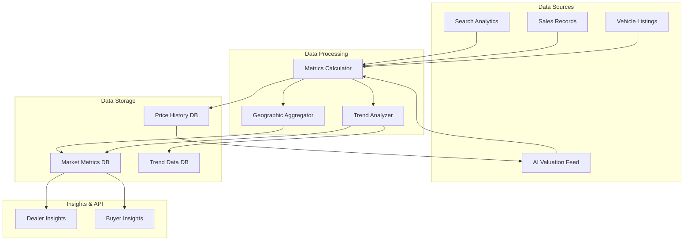

# Vehicle Market Intelligence Architecture Plan

**Date:** June 15, 2026  
**Architect:** Automotive Data Platform Architect  
**Project:** KAYAD Vehicle Market Intelligence  
**Version:** 1.0.0

---

## Executive Summary

The Vehicle Market Intelligence system provides comprehensive analytics and insights into the automotive marketplace. It tracks key metrics such as average selling prices, days on market, most viewed vehicles, search trends, and geographic patterns. The system enables data-driven decision making for dealers, provides market insights for buyers, and supplies data for future AI valuation systems.

**Key Objectives:**
- Track and analyze vehicle market trends
- Provide actionable insights for dealers
- Enable data-driven pricing decisions
- Support future AI valuation systems
- Maintain backwards compatibility with existing workflows

---

## Audit Findings

### Vehicle Listings System
**Model:** Car.js
- Basic info: title, brand, model, year, price
- Location: city, address, coordinates
- Specs: fuel, transmission, mileage, bodyType, color, condition
- Dealer association with verification status
- Status: active, sold, pending, rejected
- Auction fields: currentBid, bidsCount, auctionStatus, startingBid, reservePrice
- Analytics: views, clicks, favoritesCount
- Price history tracking
- Market price intelligence fields (avgMarketPrice, dealRating)
- Soft delete support
- Comprehensive indexes for performance

**Integration Points:**
- Price data for average listing price calculation
- Status changes for days on market tracking
- Views data for most viewed vehicles
- Location data for county trends
- Brand/model data for brand/model trends

### Sales Records
**Model:** Transaction.js
- User and car references
- Amount and currency
- Transaction types: bid_commitment, escrow_deposit, escrow_release, buy_now, refund, commission
- Status tracking: pending, success, failed, refunded, cancelled
- M-Pesa integration data
- Escrow reference
- Release timestamp

**Integration Points:**
- Transaction amounts for average selling price calculation
- Transaction types for sales vs auction analysis
- Success status for completed sales tracking
- Timestamps for time-to-sale analysis

### Auction Transactions
**Model:** Auction.js
- Car reference
- Room ID (unique)
- Status: active, ended, pending_payment, completed, cancelled
- Starting bid, highest bid
- Winner subdocument with userId, bid, assignedAt
- Bid history array
- Start/end times
- Payment deadline and status
- Reassignment count
- Commission tracking

**Integration Points:**
- Auction prices for average selling price
- Bid history for demand analysis
- Winner data for completed sales
- Time data for auction duration analysis
- Payment status for conversion tracking

### Escrow Transactions
**Model:** Escrow.js
- Car, buyer, seller references
- Amount, commission, sellerAmount
- Status: pending, held, released, refunded, disputed
- Release window and delivery confirmation
- Timeline stages with timestamps
- History tracking
- Auto-release support

**Integration Points:**
- Escrow amounts for average selling price
- Status changes for sales completion tracking
- Timeline data for time-to-sale analysis
- Release data for successful sales

### Search Behavior
**Model:** SavedSearch.js
- User reference
- Search name
- Filters object (flexible schema)
- Notification preference
- Last notified timestamp

**Integration Points:**
- Search filters for most searched vehicles
- Filter patterns for demand trends
- Geographic filters for location trends
- Price filters for price range trends

---

## Architecture Design

### System Architecture



### Architecture Design

### Metrics Tracked

| Metric | Description | Data Source |
|--------|-------------|-------------|
| Average Selling Price | Mean price of sold vehicles | Transaction, Escrow, Auction |
| Average Listing Price | Mean price of active listings | Car |
| Days on Market | Average time from listing to sale | Car.createdAt, Transaction/Escrow timestamps |
| Most Viewed Vehicles | Vehicles with highest view counts | Car.views |
| Most Searched Vehicles | Most common search filters | SavedSearch.filters |
| Fastest Selling Vehicles | Vehicles sold in shortest time | Days on market calculation |
| County Trends | Price/volume by location | Car.location.city |
| Brand Trends | Price/volume by brand | Car.brand |
| Model Trends | Price/volume by model | Car.model |

### Data Model

#### VehicleMarketAnalytics Model
```javascript
{
  // =============================
  // 📊 METADATA
  // =============================
  period: {
    type: String,
    enum: ["daily", "weekly", "monthly", "quarterly", "yearly"],
    required: true,
    index: true,
  },
  
  startDate: { type: Date, required: true, index: true },
  endDate: { type: Date, required: true },
  
  // =============================
  // 💰 PRICE METRICS
  // =============================
  averageSellingPrice: { type: Number },
  averageListingPrice: { type: Number },
  priceRange: {
    min: Number,
    max: Number,
    median: Number,
  },
  
  // =============================
  // ⏱️ TIME METRICS
  // =============================
  averageDaysOnMarket: { type: Number },
  medianDaysOnMarket: { type: Number },
  fastestSaleDays: { type: Number },
  
  // =============================
  // 📈 VOLUME METRICS
  // =============================
  totalListings: { type: Number },
  totalSales: { type: Number },
  totalAuctions: { type: Number },
  conversionRate: { type: Number },
  
  // =============================
  // 🏆 TOP VEHICLES
  // =============================
  mostViewed: [
    {
      carId: ObjectId,
      title: String,
      views: Number,
      price: Number,
    },
  ],
  
  fastestSelling: [
    {
      carId: ObjectId,
      title: String,
      daysOnMarket: Number,
      sellingPrice: Number,
    },
  ],
  
  // =============================
  // 🔍 SEARCH TRENDS
  // =============================
  topSearches: [
    {
      filters: Object,
      count: Number,
    },
  ],
  
  // =============================
  // 📍 COUNTY TRENDS
  // =============================
  countyTrends: [
    {
      county: String,
      averagePrice: Number,
      volume: Number,
      daysOnMarket: Number,
    },
  ],
  
  // =============================
  // 🚗 BRAND TRENDS
  // =============================
  brandTrends: [
    {
      brand: String,
      averagePrice: Number,
      volume: Number,
      daysOnMarket: Number,
      marketShare: Number,
    },
  ],
  
  // =============================
  // 📋 MODEL TRENDS
  // =============================
  modelTrends: [
    {
      brand: String,
      model: String,
      averagePrice: Number,
      volume: Number,
      daysOnMarket: Number,
    },
  ],
  
  // =============================
  // 📊 BREAKDOWN BY SPECS
  // =============================
  fuelTypeTrends: [
    {
      type: String,
      averagePrice: Number,
      volume: Number,
    },
  ],
  
  transmissionTrends: [
    {
      type: String,
      averagePrice: Number,
      volume: Number,
    },
  ],
  
  bodyTypeTrends: [
    {
      type: String,
      averagePrice: Number,
      volume: Number,
    },
  ],
  
  // =============================
  // 📈 TREND DATA (for charts)
  // =============================
  priceTrend: [
    {
      date: Date,
      averagePrice: Number,
      volume: Number,
    },
  ],
  
  volumeTrend: [
    {
      date: Date,
      listings: Number,
      sales: Number,
    },
  ],
  
  timestamps: true,
}
```

---

## File-by-File Implementation Plan

### 1. Database Models

#### 1.1 Create VehicleMarketAnalytics Model
**File:** `backend/models/VehicleMarketAnalytics.js`

**Schema:** As defined above

**Indexes:**
- period, startDate (composite)
- startDate, endDate (composite)

**Methods:**
- `generateDailyAnalytics()` - Generate daily analytics
- `generateWeeklyAnalytics()` - Generate weekly analytics
- `generateMonthlyAnalytics()` - Generate monthly analytics
- `getTrendData(metric, startDate, endDate)` - Get trend data for specific metric

### 2. Services

#### 2.1 Create VehicleAnalytics Service
**File:** `backend/services/vehicleAnalyticsService.js`

**Functions:**
- `calculateAverageSellingPrice(startDate, endDate)` - Calculate average selling price
- `calculateAverageListingPrice(startDate, endDate)` - Calculate average listing price
- `calculateDaysOnMarket(startDate, endDate)` - Calculate average days on market
- `getMostViewedVehicles(limit, startDate, endDate)` - Get most viewed vehicles
- `getMostSearchedVehicles(limit, startDate, endDate)` - Get most searched vehicles
- `getFastestSellingVehicles(limit, startDate, endDate)` - Get fastest selling vehicles
- `getCountyTrends(startDate, endDate)` - Get county-level trends
- `getBrandTrends(startDate, endDate)` - Get brand-level trends
- `getModelTrends(startDate, endDate)` - Get model-level trends
- `generateMarketAnalytics(period, startDate, endDate)` - Generate complete market analytics
- `getPriceTrend(startDate, endDate)` - Get price trend over time
- `getVolumeTrend(startDate, endDate)` - Get volume trend over time
- `getSpecTrends(startDate, endDate)` - Get trends by fuel, transmission, body type

#### 2.2 Create MarketTrend Scheduler
**File:** `backend/services/marketTrendScheduler.js`

**Functions:**
- `startScheduler()` - Start cron jobs for analytics generation
- `stopScheduler()` - Stop scheduler
- `generateDailyAnalytics()` - Generate daily analytics (runs at midnight)
- `generateWeeklyAnalytics()` - Generate weekly analytics (runs Sunday midnight)
- `generateMonthlyAnalytics()` - Generate monthly analytics (runs 1st of month)
- `triggerAnalyticsGeneration(period, startDate, endDate)` - Manual trigger

### 3. Controllers

#### 3.1 Create VehicleAnalytics Controller
**File:** `backend/controllers/vehicleAnalyticsController.js`

**Endpoints:**
- `GET /api/analytics/market/summary` - Get market summary
- `GET /api/analytics/market/price-trends` - Get price trends
- `GET /api/analytics/market/volume-trends` - Get volume trends
- `GET /api/analytics/market/county-trends` - Get county trends
- `GET /api/analytics/market/brand-trends` - Get brand trends
- `GET /api/analytics/market/model-trends` - Get model trends
- `GET /api/analytics/market/spec-trends` - Get spec trends
- `GET /api/analytics/market/most-viewed` - Get most viewed vehicles
- `GET /api/analytics/market/most-searched` - Get most searched vehicles
- `GET /api/analytics/market/fastest-selling` - Get fastest selling vehicles
- `GET /api/analytics/market/dealer/:dealerId` - Get dealer-specific analytics
- `POST /api/analytics/market/regenerate` - Regenerate analytics (admin)

### 4. Routes

#### 4.1 Create VehicleAnalytics Routes
**File:** `backend/routes/vehicleAnalyticsRoutes.js`

**Routes:**
- Public routes for market data
- Admin routes for analytics management

### 5. Database Migrations

#### 5.1 Create Migration Script
**File:** `backend/migrations/migrate_vehicle_market_analytics.js`

**Steps:**
1. Create VehicleMarketAnalytics collection
2. Add indexes
3. Backfill historical analytics (last 30 days daily, last 12 months monthly)
4. Generate initial market analytics

### 6. Dashboard Components

#### 6.1 Admin Analytics Dashboard
**File:** `src/components/admin/MarketAnalyticsDashboard.jsx`

**Components:**
- `MarketOverview` - Overall market metrics
- `PriceTrendChart` - Price trend visualization
- `VolumeTrendChart` - Volume trend visualization
- `CountyHeatmap` - Geographic distribution
- `BrandMarketShare` - Brand market share
- `TopPerformers` - Top vehicles by various metrics

#### 6.2 Dealer Analytics Dashboard
**File:** `src/components/dealer/DealerMarketAnalytics.jsx`

**Components:**
- `DealerMarketPosition` - Dealer's position in market
- `CompetitorPricing` - Competitor price comparison
- `MarketTrends` - Relevant market trends
- `PricingRecommendations` - AI-powered pricing suggestions
- `PerformanceMetrics` - Dealer performance vs market

### 7. Tests

#### 7.1 Create Test Suite
**File:** `backend/tests/vehicleMarketAnalytics.test.js`

**Tests:**
- Average price calculations
- Days on market calculations
- Trend data generation
- County/brand/model trend analysis
- API endpoint responses
- Scheduler functionality

---

## Database Schema Changes

### New Collections
1. **VehicleMarketAnalytics** - Store market analytics data

### No Schema Changes to Existing Collections
- Car model remains unchanged
- Transaction model remains unchanged
- Auction model remains unchanged
- Escrow model remains unchanged
- SavedSearch model remains unchanged

---

## API Endpoints

### Public Endpoints
```
GET /api/analytics/market/summary - Get market summary
GET /api/analytics/market/price-trends - Get price trends
GET /api/analytics/market/volume-trends - Get volume trends
GET /api/analytics/market/county-trends - Get county trends
GET /api/analytics/market/brand-trends - Get brand trends
GET /api/analytics/market/model-trends - Get model trends
GET /api/analytics/market/spec-trends - Get spec trends
GET /api/analytics/market/most-viewed - Get most viewed vehicles
GET /api/analytics/market/most-searched - Get most searched vehicles
GET /api/analytics/market/fastest-selling - Get fastest selling vehicles
```

### Dealer Endpoints
```
GET /api/analytics/market/dealer/:dealerId - Get dealer-specific analytics
```

### Admin Endpoints
```
POST /api/analytics/market/regenerate - Regenerate analytics
GET /api/analytics/market/admin/all - Get all analytics records
```

---

## Backwards Compatibility

### Preserved Functionality
- All existing listing workflows remain unchanged
- All existing transaction workflows remain unchanged
- All existing auction workflows remain unchanged
- All existing escrow workflows remain unchanged
- No breaking changes to existing APIs

### New Functionality (Additive Only)
- New VehicleMarketAnalytics model (separate collection)
- New vehicle analytics service (separate module)
- New market trend scheduler (separate module)
- New analytics APIs (separate routes)
- New dashboard components (additive components)

### Migration Strategy
- Zero-downtime migration
- Backfill historical data
- Gradual rollout
- Feature flags for enabling/disabling

---

## Performance Considerations

### Caching Strategy
- Cache market summary data with 1-hour TTL
- Cache trend data with 15-minute TTL
- Cache dealer analytics with 30-minute TTL
- Use Redis for distributed caching

### Batch Processing
- Process analytics in batches
- Use MongoDB aggregation for calculations
- Parallel processing where possible
- Background job scheduling

### Index Optimization
- Index on period, startDate for time-based queries
- Index on nested trend arrays for fast lookups
- Compound indexes for common filter combinations

---

## Security Considerations

### Access Control
- Public endpoints for aggregated market data
- Dealer-specific endpoints require authentication
- Admin endpoints require admin role
- Rate limiting on all endpoints

### Data Privacy
- No personal information in market analytics
- Aggregate data only
- No individual transaction details exposed

### Audit Logging
- Log all analytics regeneration
- Log all manual triggers
- Log data access patterns

---

## Monitoring and Alerting

### Metrics
- Analytics generation time
- Data freshness
- API response times
- Cache hit rates

### Alerts
- Alert on analytics generation failures
- Alert on stale data
- Alert on slow API responses
- Alert on data anomalies

---

## Success Metrics

### Platform Level
- Total analytics records generated
- API usage volume
- Dashboard engagement
- Data freshness

### Dealer Level
- Analytics dashboard usage
- Pricing adjustments based on insights
- Market position improvements

### User Level
- Market transparency
- Search relevance improvements
- Pricing confidence

---

## Implementation Timeline

### Phase 1: Foundation (Week 1)
- Create VehicleMarketAnalytics model
- Create vehicle analytics service
- Implement core calculation functions
- Create market trend scheduler

### Phase 2: APIs & Integration (Week 2)
- Create vehicle analytics controller
- Create vehicle analytics routes
- Implement API endpoints
- Test API functionality

### Phase 3: Dashboards (Week 3)
- Create admin analytics dashboard
- Create dealer analytics dashboard
- Implement visualizations
- Test dashboard functionality

### Phase 4: Testing & Launch (Week 4)
- Comprehensive testing
- Performance optimization
- Security audit
- Gradual rollout

---

## Risk Mitigation

### Technical Risks
- **Data Inconsistency:** Implement transactional updates
- **Performance Issues:** Implement caching and batch processing
- **Calculation Errors:** Implement validation and testing

### Business Risks
- **Data Accuracy:** Regular validation against source data
- **Market Sensitivity:** Careful handling of pricing data
- **Competitive Intelligence:** Protect dealer-specific insights

### Operational Risks
- **Migration Issues:** Test migration thoroughly
- **Downtime:** Zero-downtime migration strategy
- **Support Load:** Prepare support team

---

## AI Valuation System Integration

### Data Preparation
- Historical price data
- Market trend data
- Vehicle specification data
- Geographic price variations
- Seasonal patterns

### API Endpoints for AI
```
GET /api/analytics/market/valuation-data - Get data for AI valuation
GET /api/analytics/market/historical-prices - Get historical price data
GET /api/analytics/market/comparable-sales - Get comparable sales data
```

### Future Enhancements
- Machine learning model for price prediction
- Automated pricing recommendations
- Market demand forecasting
- Inventory optimization suggestions

---

## Next Steps

1. Review and approve architecture plan
2. Create VehicleMarketAnalytics model
3. Create vehicle analytics service
4. Create market trend scheduler
5. Implement API endpoints
6. Create dashboard components
7. Test thoroughly
8. Deploy to production
9. Monitor and iterate

---

**Architecture Plan Completed:** June 15, 2026  
**Next Phase:** Implementation  
**Estimated Timeline:** 4 weeks
