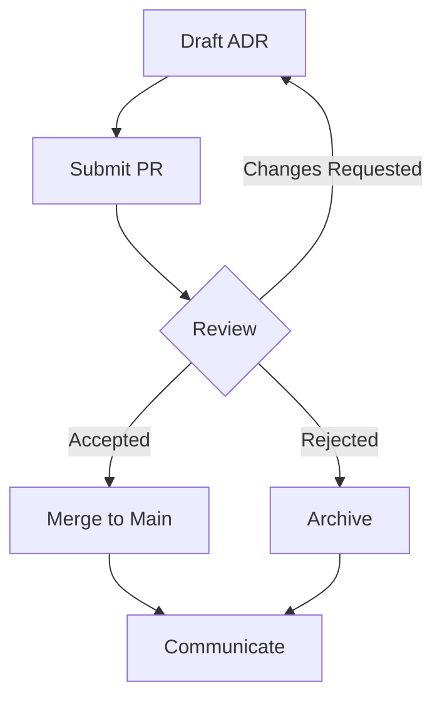

# Architecture Decision Records (ADRs)

This directory contains Architecture Decision Records (ADRs) for the KAYAD platform.

## What is an ADR?

An Architecture Decision Record (ADR) is a document that describes a significant architectural decision made for the KAYAD platform. ADRs capture the context, decision, consequences, and alternatives considered for each decision.

## ADR Template

Use the template in `0000-adr-template.md` to create new ADRs.

## ADR Index

| Number | Title | Status | Date |
|--------|-------|--------|------|
| 0000 | ADR Template | Template | - |
| 0001 | Authentication Strategy | Accepted | 2026-06-23 |
| 0002 | Payment Architecture | Accepted | 2026-06-23 |
| 0003 | Search Architecture | Accepted | 2026-06-23 |
| 0004 | Analytics Architecture | Accepted | 2026-06-23 |
| 0005 | Infrastructure Architecture | Accepted | 2026-06-23 |
| 0006 | Feature Flag Strategy | Accepted | 2026-06-23 |

## ADR Lifecycle

1. **Proposed**: ADR is drafted and proposed for review
2. **Accepted**: ADR is reviewed and accepted by the team
3. **Deprecated**: ADR is no longer applicable but kept for historical reference
4. **Superseded**: ADR is replaced by a newer ADR

## Creating a New ADR

1. Copy the template from `0000-adr-template.md`
2. Name the file with the next sequential number (e.g., `0007-new-decision.md`)
3. Fill in all sections of the template
4. Submit for review via pull request
5. Update the ADR index in this README

## ADR Review Process

1. **Draft**: Create ADR using the template
2. **Review**: Submit PR for team review
3. **Discussion**: Discuss in PR comments or team meeting
4. **Decision**: Accept, reject, or request changes
5. **Merge**: Merge accepted ADR to main branch
6. **Communicate**: Share decision with relevant stakeholders

## ADR Review Workflow

## ADR Maintenance

- Review ADRs quarterly for relevance
- Update ADRs if implementation changes
- Deprecate ADRs that are no longer applicable
- Supersede ADRs with newer decisions
- Maintain ADR index for easy reference

## ADR Best Practices

- **Be Specific**: Clearly describe the decision and its context
- **Be Honest**: Document both positive and negative consequences
- **Be Thorough**: Consider and document alternatives
- **Be Current**: Keep ADRs up to date with implementation
- **Be Accessible**: Write in clear, understandable language

## References

- [Michael Nygard's ADR Format](https://cognitect.com/blog/2011/11/15/documenting-architecture-decisions)
- [ADR Tools](https://adr.github.io/)
